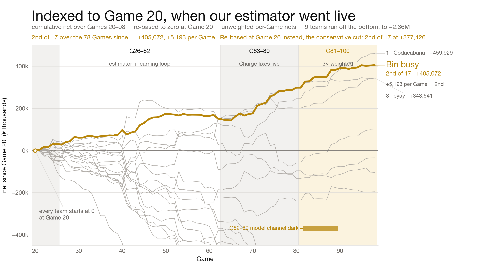

# WireClaim

**Team `Bin busy`** · QuantCo **_Claim to Fame_** · Munich Agentic Hackathon (EHL stop #3), 22–23 Aug 2026

An autonomous agent for QuantCo's insurance-pricing game. Every 12.6 minutes, for **100 Games
across 21 hours**, it decrypts a Case, reads an insurance policy, a damage description and an
invoice **with no prices**, and submits two numbers per Line Item — a **Charge** (what we invoice
every other team) and a **Limit** (the most we will pay when invoiced the same item) — inside a
**60-second** window. It ran unattended through the night.

---

## 👩‍⚖️ Judges — start here

Four files. Nothing else on this page is required reading.

| | open this | what it is | time |
| --- | --- | --- | --- |
| **1** | **[`presentation/writeup.pdf`](presentation/writeup.pdf)** | **the write-up we submitted** — 2 pages: the approach and its derivations, then the record and where we fell short | 4 min |
| **2** | [`presentation/index.html`](presentation/index.html) | the pitch deck — *download and open in a browser*, arrow keys to advance | 5 min |
| **3** | [`WRITEUP.md`](WRITEUP.md) | the same argument in Markdown, so you can read it **right here in GitHub** without downloading anything | 4 min |
| **4** | [`presentation/writeup-full.pdf`](presentation/writeup-full.pdf) | the complete version — the rejected hypotheses and the two traps that cost us a working session | 12 min |

Everything below is a **map**. Jump to whatever you want to check.

<p align="center">
  <picture>
    <source media="(prefers-color-scheme: dark)" srcset="presentation/figures/rebased-g20-dark.png">
    
  </picture>
</p>

---

## The one idea, in a paragraph

Behind every Line Item is a secret Fair Value `t`. The payoff table has one row people skip:
**when a reviewer wrongfully rejects a fair claim, the issuer is still paid** — and the reviewer
pays a `1.5×` penalty on top. So a Charge at or below `t` is owed by *every* opponent no matter
what they do, while a Charge above `t` is paid only by the few who accept. The Charge is a
**cliff, not a slope**. Our whole system exists to find the safe side of that cliff: models
**read** the policy and emit structured evidence, and deterministic code **prices** it
([ADR 0001](docs/brainstorm/sebi/adr/0001-the-model-reads-the-engine-prices.md)). No model output
is ever a price.

The second idea is that `t` is secret but **exactly recoverable** from the public leaderboard
after a Game settles — which turns the tournament into a measurement instrument, and turns every
claim in our write-up into a measurement rather than an argument.

---

## 🔍 "Show me the code that decides the number"

In the order a single Game touches it:

| step | file | what it decides |
| --- | --- | --- |
| 1 · clock & Case | [`main.py`](main.py) · [`src/data/case_loader.py`](src/data/case_loader.py) | wait for the Game, fetch the key, unzip, parse the invoice, slice the Policy |
| 2 · evidence | [`src/strategies/strategy2/prompts.py`](src/strategies/strategy2/prompts.py) · [`channels.py`](src/strategies/strategy2/channels.py) · [`src/evidence/policy/`](src/evidence/policy/) | coverage **probability**, a price **band**, the Policy clause **quoted verbatim** |
| 3 · memory | [`src/evidence/memory.py`](src/evidence/memory.py) | the Price Memory anchor from every Fair Value we have ever recovered |
| 4 · blend | [`src/strategies/strategy2/blend.py`](src/strategies/strategy2/blend.py) | two model draws + the anchor, inverse-variance in log space → a posterior |
| 5 · **pricing** | **[`src/pricing/engine.py`](src/pricing/engine.py)** | **the Charge and the Limit — the only place in the repo a scored number is decided** |
| 6 · submission | [`src/runtime/submission_coordinator.py`](src/runtime/submission_coordinator.py) · [`src/api/tournament.py`](src/api/tournament.py) | four sequenced posts per Game, merged **per Line Item**, so partial output is never discarded |
| 7 · learning | [`scripts/learn_from_game.py`](scripts/learn_from_game.py) · [`src/runtime/decisions.py`](src/runtime/decisions.py) | joins the decision log against the recovered Fair Value and names **the stage that was wrong** |

Three strategies price every Case and a [router](src/strategies/router.py) picks one;
[`strategy2`](src/strategies/strategy2/) wins most Games. A [fast path](src/strategies/fast_path.py)
guarantees something is submitted even if the models are slow.

---

## ✅ "Prove it" — every number here is reproducible

| run this | what it proves |
| --- | --- |
| `python scripts/invert_fair_values.py --verify` | recovers a `[t_lo, t_hi)` bracket for **every settled Line Item** from public Transactions, and asserts it reproduces **every published net to the cent** across 52,224 rows |
| `python scripts/replay_payoffs.py` | scores any hypothetical submission against the real Field with all sixteen opponents held fixed — and self-checks that our *actual* submission reproduces the authoritative net for every Game |
| `pixi run test` | **389 unit tests** across 34 modules. The replay self-check is a test, not a comment — without it none of our numbers mean anything |
| `pixi run case-0` | the permanent test Game — a full dry run, end to end, that costs nothing |

The two scripts above are why we can say *measured* instead of *we think*. Start with
[`scripts/invert_fair_values.py`](scripts/invert_fair_values.py) if you only look at one.

---

## 📊 "What did it actually score?"

| where | what |
| --- | --- |
| [`case_analysis/dashboard.md`](case_analysis/dashboard.md) | **the live dashboard** — regenerated every ~10 min from the public leaderboard by [a GitHub Action](.github/workflows/case-analysis.yml) |
| [`case_analysis/data/`](case_analysis/data/) | the machine-readable record: `teams.csv` (net per team per Game), `ourvalues.csv` (our `a`, `b`, derived `t`, and the net per item), `analysis.json` |
| [`case_analysis/DATA_LAYOUT.md`](case_analysis/DATA_LAYOUT.md) | what every column in those files means |
| [`presentation/figures/`](presentation/figures/) | the charts in the write-up and the deck, light and dark, PNG and PDF |

---

## 🧠 "How did you decide that?"

| where | what |
| --- | --- |
| [`docs/GAME-AND-PROOFS.md`](docs/GAME-AND-PROOFS.md) | **the rules and the arithmetic** — the verified schedule and the fifteen derived results R1–R10, with §4 listing the claims we got wrong and corrected |
| [`docs/METHODOLOGY.md`](docs/METHODOLOGY.md) | how we decided things, in one denser page |
| [`docs/methodology-full.md`](docs/methodology-full.md) | the appendix, with every table |
| [`docs/ARCHITECTURE.md`](docs/ARCHITECTURE.md) | the design, and why the seams sit where they do |
| [`docs/brainstorm/sebi/adr/`](docs/brainstorm/sebi/adr/) | architecture decision records — [ADR 0001](docs/brainstorm/sebi/adr/0001-the-model-reads-the-engine-prices.md) is the one that shaped everything |
| [`docs/brainstorm/sebi/strats/review/hypothesis-ledger.md`](docs/brainstorm/sebi/strats/review/hypothesis-ledger.md) | **every hypothesis we tested, with the number that killed or kept it** — including four plausible ideas that are falsified with evidence attached |
| [`docs/CONTEXT.md`](docs/CONTEXT.md) | the glossary. Charge / Limit / Fair Value / Line Item / Case / Game / Issuer / Reviewer |
| [`docs/diagrams/`](docs/diagrams/) | the game timeline, the per-Line-Item decision, and the component diagram (SVG + PNG) |
| [`docs/GAME_DESCRIPTION.md`](docs/GAME_DESCRIPTION.md) | the original QuantCo handout, for reference |

---

## 🗂 Every directory, one line each

```
README.md                   you are here — the map
WRITEUP.md                  the submitted write-up, in Markdown
CLAUDE.md                   the agent knowledge file: conventions, and the mistakes we already paid for
main.py                     the tournament clock — waits for each Game and drives the pipeline

presentation/               the deliverables: writeup.pdf, writeup-full.pdf, index.html (deck),
                            RUNSHEET.md (the 5-min run sheet + Q&A answers), figures/, diagrams/
docs/                       the reasoning: GAME-AND-PROOFS.md, METHODOLOGY.md, ARCHITECTURE.md,
                            CONTEXT.md (glossary), diagrams/, brainstorm/ (pitches + ADRs + the ledger)
src/                        the pipeline — see the table above. engine.py is where the money is decided
scripts/                    one-shot analysis and the learning loop; invert_fair_values.py is the keystone
tests/                      389 unit tests
case_analysis/              the live scoreboard analysis, regenerated by CI every ~10 minutes
backtesting/                the offline harness that replays candidate strategies against the real Field
data/schedule.json          the 100 Game start times, pinned locally
var/                        the per-Game record: what we estimated, what happened, what the model replied
[PUBLIC] EHL Cases/         the encrypted Case archives as published by the organisers
```

> **On what is *not* committed.** Decrypted Case material stays out of the repo — the organisers
> attach a ranking penalty to publishing their policies and invoices, and it is not ours to
> publish. Everything needed to regenerate it from the archives plus a released key is here.

---

## ▶️ Run it

```bash
pixi install
cp .env.example .env          # then add TEAM_API_KEY
pixi run test                 # 389 tests — green is the floor
pixi run case-0               # a full dry run on the permanent test Game
```

The whole tournament is two terminals, two commands:

```bash
pixi run play      # terminal 1: plays every Game on the schedule, restarts itself if it dies
pixi run watch     # terminal 2: analyses each Game as it settles, and learns from it
```

`play` runs under a supervisor on purpose. Break-even uptime in this game is **71 %** — an
all-or-nothing smart bot needs that much merely to tie a dumb bot that never misses — so an
uncaught exception must cost one Game, never the tournament. Full operator notes, and the rest of
the task list, are in [`docs/GAME-AND-PROOFS.md`](docs/GAME-AND-PROOFS.md#setup).

---

## Fair play

Inference from the **published** leaderboard is the core of our method, so we asked the organisers
before building on it, and it is allowed. We never coordinated with another team, never used
another team's key, never obtained a decryption key before release, never read an unsettled
submission, and read the leaderboard at the rate a browser would.
