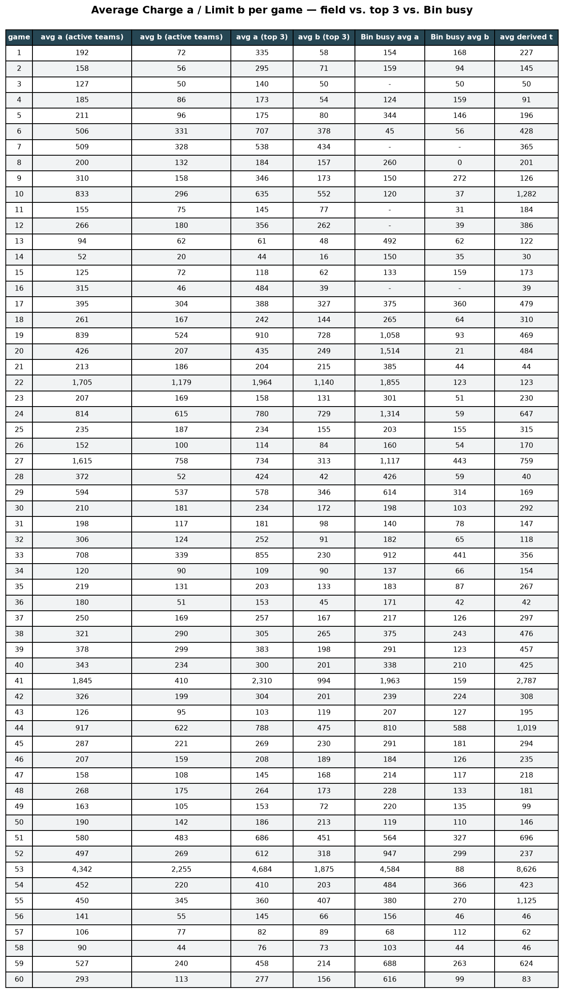

# Case Analysis — Live Dashboard

Main analysis page for team **Bin busy** in the Claim-to-Fame tournament. Everything below is
regenerated automatically every ~10 minutes from the public settled leaderboard data
(`.github/workflows/case-analysis.yml` runs `case_analysis/run_all.py`).

## How to read this (for an AI strategy optimizer)

Definitions (see `docs/CONTEXT.md` / `README.md` for the rules):

- `a` = Charge (what we invoice every opponent per Line Item), `b` = Limit (max we pay as Reviewer),
  `t` = hidden Fair Value, `c ≥ 4t` = Cap on accepted payouts.
- Payoffs per opponent pair: accepted → issuer gets `min(a, c)`; rejected fair Charge (`a ≤ t`) →
  issuer still gets `a` AND the reviewer pays an extra `0.5a` (total `1.5a`); rejected Overcharge
  (`a > t`) → nothing moves.
- `t (derived)` is bracketed from settled data: largest rejected-but-paid Charge ≤ t < smallest
  zero-payout rejection. Unbounded brackets mean nobody was caught Overcharging on that item.
- Target policy derived from history: `a ≈ 0.7 × t̂`, `b ≈ 0.5–1.0 × t̂` (never 0, never far above t̂);
  charge high only on items believed uncovered (t = 0) or when the field is dark.
- Optimization signals: keep `a/t ≤ 1` on covered items (income even when rejected), keep `b/t`
  in 0.5–1.0 (below → 1.5a lawyer-fee leak; above → pay opponents' Overcharges), lawyer fees per
  round < 5k, paid-over ≈ 0.

Machine-readable files (all in `data/`): `analysis.json` (per-game, per-item `charges_a`,
`limits_b` intervals, `t_lo`/`t_hi`/`t_point`, `fair_flags`), `ourvalues.csv`, `tvalues.csv`,
`teams.csv`, `balance.csv`, `binbusy_money.csv`. Layout details: `DATA_LAYOUT.md`.

## Bin busy — actual submitted values vs. derived t (last 10 rounds)

Our real submissions (`charge_decided` / `limit_decided` from `var/export/line_items.csv`;
rows marked `reconstructed` fall back to the public inversion), the derived `t`, the
normalized ratios `a/t` and `b/t`, the net on each item, and the net per round.

<!-- OURVALUES:START -->

Per line item, last 10 settled games (full file: `data/ourvalues.csv`):

| game | item | a (actual) | b (actual) | t (derived) | a/t | b/t | item net | source |
|---|---|---|---|---|---|---|---|---|
| 51 | 1 | 448.76 | 267.51 | 469.04 | 0.96 | 0.57 | 271.28 | submitted |
| 51 | 2 | 902.67 | 596.14 | 2,539.45 | 0.36 | 0.23 | -14,799.65 | submitted |
| 51 | 3 | 525.80 | 332.51 | 731.20 | 0.72 | 0.45 | 2,015.21 | submitted |
| 51 | 4 | 75.52 | 75.52 | 150.65 | 0.50 | 0.50 | -210.57 | submitted |
| 51 | 5 | 1,369.61 | 708.00 | 204.25 | 6.71 | 3.47 | 9,960.42 | submitted |
| 51 | 6 | 63.62 | 63.62 | 78.85 | 0.81 | 0.81 | 278.99 | submitted |
| 52 | 1 | 946.62 | 584.57 | 451.36 | 2.10 | 1.30 | -1,598.32 | submitted |
| 52 | 2 | 1,829.33 | 0.00 | 22.50 | 81.30 | 0.00 | 0.00 | submitted |
| 53 | 1 | 4,583.84 | 0.00 | 8,626.50 | 0.53 | 0.00 | -4,451.71 | submitted |
| 53 | 2 | 169.13 | 0.00 | 0.00 | - | - | 0.00 | submitted |
| 54 | 1 | 1,747.03 | 1,507.50 | 2,090.00 | 0.84 | 0.72 | 6,387.22 | reconstructed |
| 54 | 2 | 1,723.46 | 1,469.38 | 1,435.00 | 1.20 | 1.02 | -5,291.02 | reconstructed |
| 54 | 3 | 64.06 | 22.50 | 22.50 | 2.85 | 1.00 | 64.06 | reconstructed |
| 54 | 4 | 434.94 | 446.82 | 500.15 | 0.87 | 0.89 | 2,695.92 | reconstructed |
| 54 | 5 | 434.94 | 419.21 | 498.24 | 0.87 | 0.84 | 2,625.80 | reconstructed |
| 54 | 6 | - | 22.50 | 22.50 | - | 1.00 | 0.00 | reconstructed |
| 54 | 7 | 162.60 | 100.97 | 49.45 | 3.29 | 2.04 | 189.49 | reconstructed |
| 54 | 8 | 68.51 | 1.60 | 1.60 | 42.82 | 1.00 | 68.51 | reconstructed |
| 54 | 9 | 64.06 | 16.07 | 16.07 | 3.99 | 1.00 | 64.06 | reconstructed |
| 54 | 10 | 73.57 | 8.17 | 8.17 | 9.00 | 1.00 | 73.57 | reconstructed |
| 54 | 11 | 64.06 | 6.50 | 6.50 | 9.86 | 1.00 | 64.06 | reconstructed |
| 55 | 1 | 379.98 | 269.50 | 1,125.00 | 0.34 | 0.24 | -3,282.02 | reconstructed |
| 56 | 1 | 156.06 | 102.81 | 102.81 | 1.52 | 1.00 | 632.40 | reconstructed |
| 56 | 2 | - | 22.50 | 22.50 | - | 1.00 | 0.00 | reconstructed |
| 56 | 3 | - | 12.32 | 12.32 | - | 1.00 | 0.00 | reconstructed |
| 56 | 4 | - | 0.00 | 0.00 | - | - | 0.00 | reconstructed |
| 57 | 1 | - | 741.73 | 226.00 | - | 3.28 | -2,610.38 | reconstructed |
| 57 | 2 | 242.58 | 161.61 | 131.88 | 1.84 | 1.23 | -445.75 | reconstructed |
| 57 | 3 | 35.85 | 26.45 | 26.45 | 1.36 | 1.00 | 61.76 | reconstructed |
| 57 | 4 | 54.50 | 56.53 | 26.34 | 2.07 | 2.15 | -37.26 | reconstructed |
| 57 | 5 | 115.61 | 109.61 | 141.00 | 0.82 | 0.78 | 587.35 | reconstructed |
| 57 | 6 | 26.51 | 20.44 | 2.12 | 12.48 | 9.62 | 64.86 | reconstructed |
| 57 | 7 | 30.27 | 29.01 | 11.07 | 2.73 | 2.62 | 314.09 | reconstructed |
| 57 | 8 | 56.31 | 60.50 | 25.34 | 2.22 | 2.39 | 572.03 | reconstructed |
| 57 | 9 | 57.00 | 56.04 | 26.34 | 2.16 | 2.13 | 52.87 | reconstructed |
| 57 | 10 | 95.77 | 99.08 | 141.00 | 0.68 | 0.70 | 186.34 | reconstructed |
| 57 | 11 | 15.79 | 8.75 | 2.12 | 7.43 | 4.12 | 90.49 | reconstructed |
| 57 | 12 | 30.27 | 29.01 | 13.50 | 2.24 | 2.15 | 336.24 | reconstructed |
| 57 | 13 | 58.58 | 56.50 | 26.50 | 2.21 | 2.13 | 649.96 | reconstructed |
| 58 | 1 | 169.20 | 35.00 | 35.00 | 4.83 | 1.00 | 507.60 | reconstructed |
| 58 | 2 | 33.73 | 7.00 | 7.00 | 4.82 | 1.00 | 33.73 | reconstructed |
| 58 | 3 | 112.47 | 20.40 | 20.40 | 5.51 | 1.00 | 112.47 | reconstructed |
| 58 | 4 | 64.06 | 8.00 | 8.00 | 8.01 | 1.00 | 192.18 | reconstructed |
| 58 | 5 | 259.74 | 184.36 | 239.77 | 1.08 | 0.77 | -1,624.55 | reconstructed |
| 58 | 6 | - | 0.00 | 0.00 | - | - | 0.00 | reconstructed |
| 58 | 7 | 49.62 | 50.91 | 6.97 | 7.11 | 7.30 | 79.59 | reconstructed |
| 58 | 8 | - | 0.00 | 0.00 | - | - | 0.00 | reconstructed |
| 58 | 9 | 33.73 | 4.00 | 4.00 | 8.43 | 1.00 | 33.73 | reconstructed |
| 59 | 1 | 299.23 | 287.69 | 540.00 | 0.55 | 0.53 | -278.41 | reconstructed |
| 59 | 2 | 1,428.18 | 412.97 | 1,451.09 | 0.98 | 0.28 | 3,211.92 | reconstructed |
| 59 | 3 | 321.94 | 317.13 | 1,036.19 | 0.31 | 0.31 | -3,546.22 | reconstructed |
| 59 | 4 | 350.57 | 211.75 | 315.53 | 1.11 | 0.67 | -759.87 | reconstructed |
| 59 | 5 | 1,200.66 | 610.26 | 1,011.83 | 1.19 | 0.60 | -6,309.06 | reconstructed |
| 59 | 6 | - | 5.68 | 5.68 | - | 1.00 | 0.00 | reconstructed |
| 59 | 7 | 524.94 | 239.00 | 619.72 | 0.85 | 0.39 | 311.08 | reconstructed |
| 59 | 8 | - | 15.60 | 15.60 | - | 1.00 | 0.00 | reconstructed |
| 59 | 9 | - | 0.00 | 0.00 | - | - | 0.00 | reconstructed |
| 60 | 1 | 281.49 | 141.00 | 140.75 | 2.00 | 1.00 | 3,659.37 | reconstructed |
| 60 | 2 | 2,065.13 | 686.05 | 544.30 | 3.79 | 1.26 | -1,768.76 | reconstructed |
| 60 | 3 | - | 2.64 | 2.64 | - | 1.00 | 0.00 | reconstructed |
| 60 | 4 | - | 2.80 | 2.80 | - | 1.00 | 0.00 | reconstructed |
| 60 | 5 | - | 2.28 | 2.28 | - | 1.00 | 0.00 | reconstructed |
| 60 | 6 | - | 0.00 | 0.00 | - | - | 0.00 | reconstructed |
| 60 | 7 | - | 0.00 | 0.00 | - | - | 0.00 | reconstructed |
| 60 | 8 | - | 22.50 | 22.50 | - | 1.00 | 0.00 | reconstructed |
| 60 | 9 | - | 15.50 | 15.50 | - | 1.00 | 0.00 | reconstructed |
| 60 | 10 | 64.06 | 13.50 | 13.50 | 4.75 | 1.00 | 192.18 | reconstructed |
| 60 | 11 | 51.75 | 1.45 | 1.45 | 35.81 | 1.00 | 155.25 | reconstructed |

Net per round:

| game | net |
|---|---|
| 51 | -2,484.32 |
| 52 | -1,598.32 |
| 53 | -4,451.71 |
| 54 | 6,941.68 |
| 55 | -3,282.02 |
| 56 | 632.40 |
| 57 | -177.40 |
| 58 | -665.25 |
| 59 | -7,370.56 |
| 60 | 2,238.04 |
<!-- OURVALUES:END -->

## Number tables

Per-line-item t values with the best performers, and the best-teams-per-game breakdown:
[`tables.md`](tables.md).

## Total balance per team

Cumulative net per team over all settled games (income as Issuer minus costs as Reviewer,
incl. 1.5a lawyer penalties). Bin busy is the thick black line.

## Bin busy — money flows & lawyer fees

Income received as Issuer vs. what we paid out as Reviewer (accepted payouts + 1.5a lawyer
penalties), with the net line. Bottom panel: how often per game our Limit wrongly rejected a fair
Charge and what those 1.5a penalties cost.

## Bin busy — fraud calls vs. reality

Per game: how many Line Items really had a derived t = 0, on how many Bin busy said "fraud"
(rejected every nonzero Charge, i.e. acted as if b = 0), how many of those calls were right,
and the same fraud-call rate averaged over the top-3 / top-5 teams.

## Per-game averages — field vs. top 3 vs. Bin busy

Average Charge a and Limit b of all active teams (always-zero teams excluded), the top-3 by net,
Bin busy's own values, and the average derived Fair Value t.

## Trend dashboard

Net per team, per-game average a / b / derived t, fraud-zone rate by team, and median Charge
relative to derived t.

