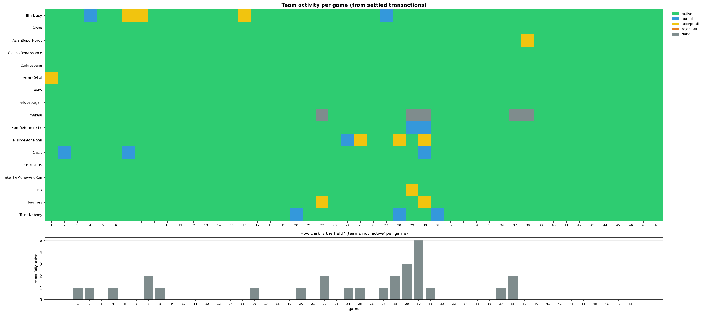

# Case Analysis — Live Results

All images below are regenerated automatically every 15 minutes from the settled leaderboard data
(see `.github/workflows/case-analysis.yml`). Newest / most important first.

Number-only comparison tables live in [`tables.md`](tables.md).

## Who is awake? — inactive teams per game

Each team classified per game from its settled transactions: active, autopilot (one
constant fallback Charge on most items), accept-all (Limit effectively infinite),
reject-all (Limit ~0, pays 1.5a penalties), or dark (default a=0, b=0 — a money
fountain). Bottom: count of not-fully-active teams — when it's high, Overcharging pays.
Full grid in `data/activity.csv`.

## Total balance per team

Cumulative net per team over all settled games (income as Issuer minus costs as Reviewer,
incl. 1.5a lawyer penalties). Bin busy is the thick black line.

## Bin busy — money flows & lawyer fees

Income received as Issuer vs. what we paid out as Reviewer (accepted payouts + 1.5a lawyer
penalties), with the net line. Bottom panel: how often per game our Limit wrongly rejected a fair
Charge and what those 1.5a penalties cost — this is where we get "scammed".

## Bin busy — fraud calls vs. reality

Per game: how many Line Items really had a derived t = 0, on how many Bin busy said "fraud"
(rejected every nonzero Charge, i.e. acted as if b = 0), how many of those calls were right,
and the same fraud-call rate averaged over the top-3 / top-5 teams.

## Per-game averages — field vs. top 3 vs. Bin busy

Average Charge a and Limit b of all active teams (always-zero teams excluded), the top-3 by net,
Bin busy's own values, and the average derived Fair Value t.

## Trend dashboard

Net per team, per-game average a / b / derived t, fraud-zone rate by team, and median Charge
relative to derived t.

