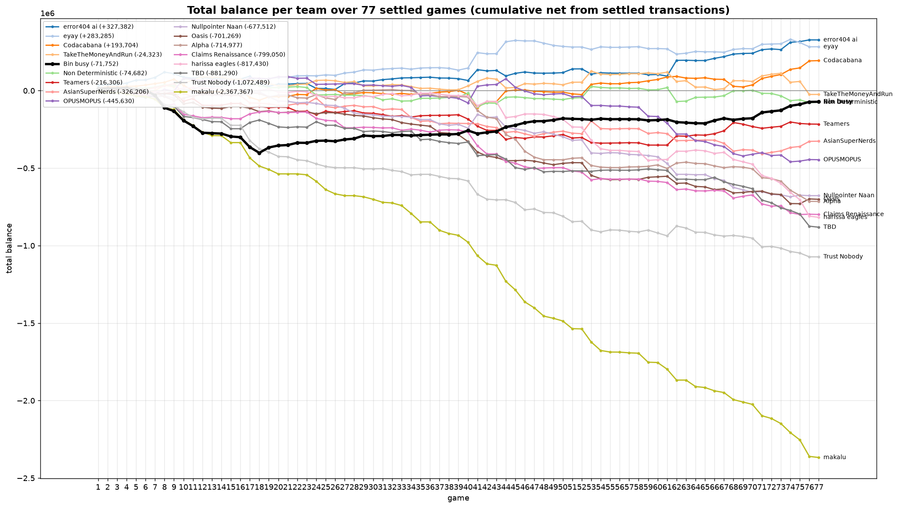
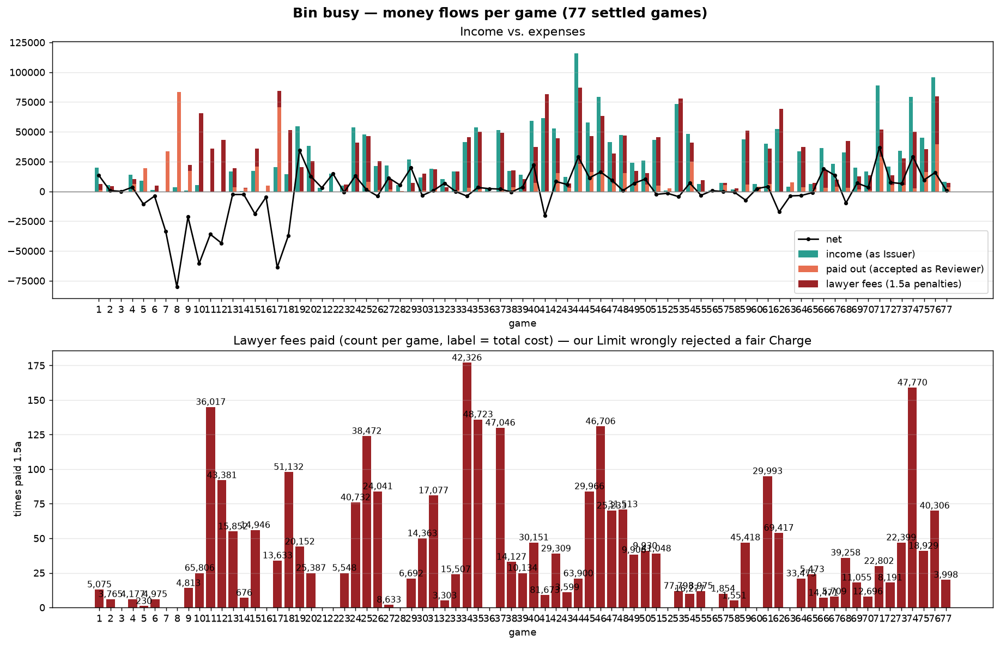
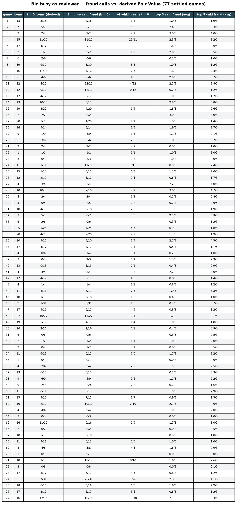
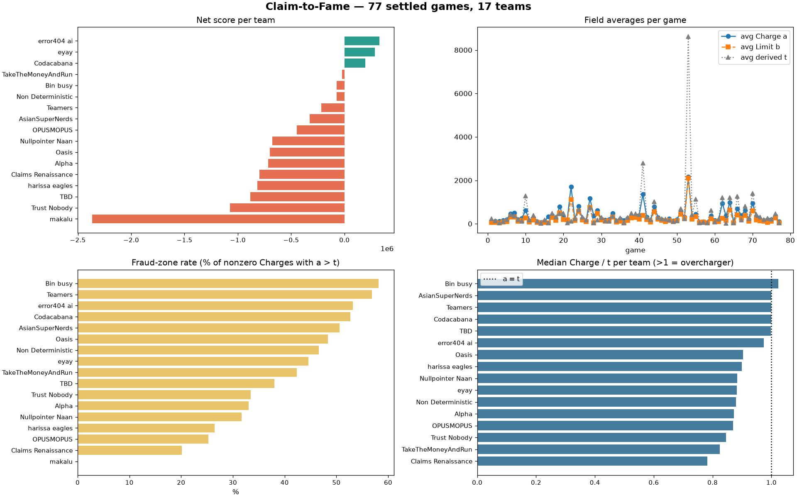

# Case Analysis — Live Dashboard

Main analysis page for team **Bin busy** in the Claim-to-Fame tournament. Everything below is
regenerated automatically every ~10 minutes from the public settled leaderboard data
(`.github/workflows/case-analysis.yml` runs `case_analysis/run_all.py`).

## How to read this (for an AI strategy optimizer)

Definitions (see `docs/CONTEXT.md` / `README.md` for the rules):

- `a` = Charge (what we invoice every opponent per Line Item), `b` = Limit (max we pay as Reviewer),
  `t` = hidden Fair Value, `c ≥ 4t` = Cap on accepted payouts.
- Payoffs per opponent pair: accepted → issuer gets `min(a, c)`; rejected fair Charge (`a ≤ t`) →
  issuer still gets `a` AND the reviewer pays an extra `0.5a` (total `1.5a`); rejected Overcharge
  (`a > t`) → nothing moves.
- `t (derived)` is bracketed from settled data: largest rejected-but-paid Charge ≤ t < smallest
  zero-payout rejection. Unbounded brackets mean nobody was caught Overcharging on that item.
- Target policy derived from history: `a ≈ 0.7 × t̂`, `b ≈ 0.5–1.0 × t̂` (never 0, never far above t̂);
  charge high only on items believed uncovered (t = 0) or when the field is dark.
- Optimization signals: keep `a/t ≤ 1` on covered items (income even when rejected), keep `b/t`
  in 0.5–1.0 (below → 1.5a lawyer-fee leak; above → pay opponents' Overcharges), lawyer fees per
  round < 5k, paid-over ≈ 0.

Machine-readable files (all in `data/`): `analysis.json` (per-game, per-item `charges_a`,
`limits_b` intervals, `t_lo`/`t_hi`/`t_point`, `fair_flags`), `ourvalues.csv`, `tvalues.csv`,
`teams.csv`, `balance.csv`, `binbusy_money.csv`. Layout details: `DATA_LAYOUT.md`.

## Bin busy — actual submitted values vs. derived t (last 10 rounds)

Our real submissions (`charge_decided` / `limit_decided` from `var/export/line_items.csv`;
rows marked `reconstructed` fall back to the public inversion), the derived `t`, the
normalized ratios `a/t` and `b/t`, the net on each item, and the net per round.

<!-- OURVALUES:START -->

Per line item, last 10 settled games (full file: `data/ourvalues.csv`):

| game | item | name | a (actual) | b (actual) | t (derived) | a/t | b/t | item net | source |
|---|---|---|---|---|---|---|---|---|---|
| 68 | 1 | Replacement of stolen everyday clothing and personal (1   pcs) | 551.11 | 381.84 | 1,554.59 | 0.35 | 0.25 | -3,676.94 | submitted |
| 68 | 2 | Replacement of a winter coat that had been worn only (1   pcs) | 223.11 | 144.00 | 499.12 | 0.45 | 0.29 | -827.83 | submitted |
| 68 | 3 | Premium designer jacket to replace a stolen mid-range (1   pcs) | 256.20 | 211.55 | 855.00 | 0.30 | 0.25 | -66.74 | submitted |
| 68 | 4 | Stolen jewellery - several unscheduled everyday (1   pcs) | 540.60 | 0.00 | 2,234.00 | 0.24 | 0.00 | -6,490.81 | submitted |
| 68 | 5 | Stolen jewellery - one high-value ring listed on the (1   pcs) | 5,941.79 | 708.00 | 2,635.50 | 2.25 | 0.27 | 734.12 | submitted |
| 68 | 6 | Claimed antique brooch with no receipt, photograph or (1   pcs) | 401.29 | 0.00 | 0.00 | - | - | 0.00 | submitted |
| 68 | 7 | Personal mileage to and from the police station to (1   flat rate) | 15.94 | 0.00 | 2.70 | 5.90 | 0.00 | 15.94 | submitted |
| 68 | 8 | Time spent compiling and reporting the claim (1   flat rate) | 120.59 | 0.00 | 8.00 | 15.07 | 0.00 | 0.00 | submitted |
| 68 | 9 | Emergency boarding of the forced entry door on the (1   flat rate) | 309.24 | 195.63 | 177.61 | 1.74 | 1.10 | -25.73 | submitted |
| 68 | 10 | Replacement lock and cylinder for the forced door (1   flat rate) | 266.69 | 171.00 | 140.25 | 1.90 | 1.22 | 618.14 | submitted |
| 68 | 11 | Cleaning of muddy footprints tracked through the (1   –) | 103.11 | 0.00 | 10.62 | 9.70 | 0.00 | 0.00 | submitted |
| 69 | 1 | - | 1,031.26 | 660.44 | 1,293.12 | 0.80 | 0.51 | 5,718.20 | reconstructed |
| 69 | 2 | - | - | 18.28 | 18.28 | - | 1.00 | 0.00 | reconstructed |
| 69 | 3 | - | 182.41 | 71.25 | 166.53 | 1.10 | 0.43 | 831.79 | reconstructed |
| 69 | 4 | - | 93.34 | 56.39 | 114.77 | 0.81 | 0.49 | 30.33 | reconstructed |
| 69 | 5 | - | - | 14.50 | 14.50 | - | 1.00 | 0.00 | reconstructed |
| 69 | 6 | - | - | 0.00 | 0.00 | - | - | 0.00 | reconstructed |
| 69 | 7 | - | 395.01 | 32.50 | 32.50 | 12.15 | 1.00 | 395.01 | reconstructed |
| 69 | 8 | - | 24.66 | 4.00 | 4.00 | 6.17 | 1.00 | 49.32 | reconstructed |
| 70 | 1 | - | 1,058.30 | 669.21 | 1,400.00 | 0.76 | 0.48 | 3,361.93 | reconstructed |
| 71 | 1 | - | 991.57 | 875.70 | 1,185.60 | 0.84 | 0.74 | 2,399.63 | reconstructed |
| 71 | 2 | - | - | 6.00 | 6.00 | - | 1.00 | 0.00 | reconstructed |
| 71 | 3 | - | - | 4.00 | 4.00 | - | 1.00 | 0.00 | reconstructed |
| 71 | 4 | - | 50.02 | 6.99 | 149.88 | 0.33 | 0.05 | 63.55 | reconstructed |
| 71 | 5 | - | 71.52 | 76.75 | 62.46 | 1.15 | 1.23 | -124.65 | reconstructed |
| 71 | 6 | - | - | 294.00 | 294.00 | - | 1.00 | 0.00 | reconstructed |
| 71 | 7 | - | 245.55 | 10.98 | 685.10 | 0.36 | 0.02 | 227.37 | reconstructed |
| 71 | 8 | - | - | 4.00 | 4.00 | - | 1.00 | 0.00 | reconstructed |
| 71 | 9 | - | 572.53 | 380.03 | 617.34 | 0.93 | 0.62 | 5,146.74 | reconstructed |
| 71 | 10 | - | 3,651.82 | 3,671.65 | 3,912.31 | 0.93 | 0.94 | 30,102.60 | reconstructed |
| 71 | 11 | - | - | 178.50 | 178.50 | - | 1.00 | 0.00 | reconstructed |
| 71 | 12 | - | - | 75.27 | 60.29 | - | 1.25 | -428.98 | reconstructed |
| 71 | 13 | - | - | 64.37 | 4.00 | - | 16.09 | -356.16 | reconstructed |
| 71 | 14 | - | - | 9.00 | 9.00 | - | 1.00 | 0.00 | reconstructed |
| 71 | 15 | - | - | 20.54 | 20.54 | - | 1.00 | 0.00 | reconstructed |
| 71 | 16 | - | - | 0.00 | 0.00 | - | - | 0.00 | reconstructed |
| 71 | 17 | - | - | 14.00 | 14.00 | - | 1.00 | 0.00 | reconstructed |
| 71 | 18 | - | 163.14 | 109.68 | 22.76 | 7.17 | 4.82 | -153.26 | reconstructed |
| 72 | 1 | - | 457.57 | 413.25 | 598.80 | 0.76 | 0.69 | 2,821.84 | reconstructed |
| 72 | 2 | - | 453.31 | 490.87 | 522.50 | 0.87 | 0.94 | 2,678.20 | reconstructed |
| 72 | 3 | - | 199.48 | 210.82 | 259.69 | 0.77 | 0.81 | 1,500.19 | reconstructed |
| 72 | 4 | - | 60.42 | 66.06 | 82.31 | 0.73 | 0.80 | 390.90 | reconstructed |
| 72 | 5 | - | 402.97 | 231.81 | 330.28 | 1.22 | 0.70 | -267.59 | reconstructed |
| 72 | 6 | - | - | 0.00 | 0.00 | - | - | 0.00 | reconstructed |
| 72 | 7 | - | - | 0.00 | 0.00 | - | - | 0.00 | reconstructed |
| 72 | 8 | - | 60.42 | 65.41 | 79.13 | 0.76 | 0.83 | 398.69 | reconstructed |
| 73 | 1 | - | 96.84 | 106.60 | 107.52 | 0.90 | 0.99 | 1,150.36 | reconstructed |
| 73 | 2 | - | 227.37 | 230.87 | 292.80 | 0.78 | 0.79 | 1,020.74 | reconstructed |
| 73 | 3 | - | 88.13 | 16.07 | 16.07 | 5.49 | 1.00 | 176.26 | reconstructed |
| 73 | 4 | - | 35.24 | 32.75 | 37.14 | 0.95 | 0.88 | 467.43 | reconstructed |
| 73 | 5 | - | 68.33 | 65.50 | 62.16 | 1.10 | 1.05 | 236.36 | reconstructed |
| 73 | 6 | - | 51.57 | 49.16 | 114.00 | 0.45 | 0.43 | -203.69 | reconstructed |
| 73 | 7 | - | 169.59 | 148.62 | 216.22 | 0.78 | 0.69 | 518.51 | reconstructed |
| 73 | 8 | - | 147.79 | 153.38 | 144.39 | 1.02 | 1.06 | -336.23 | reconstructed |
| 73 | 9 | - | 439.10 | 290.12 | 439.11 | 1.00 | 0.66 | 2,623.26 | reconstructed |
| 73 | 10 | - | - | 0.00 | 0.00 | - | - | 0.00 | reconstructed |
| 73 | 11 | - | 62.24 | 44.12 | 51.95 | 1.20 | 0.85 | -275.23 | reconstructed |
| 73 | 12 | - | 60.42 | 63.70 | 89.42 | 0.68 | 0.71 | 284.85 | reconstructed |
| 73 | 13 | - | 866.60 | 610.83 | 1,332.50 | 0.65 | 0.46 | -282.93 | reconstructed |
| 73 | 14 | - | 291.88 | 33.50 | 85.42 | 3.42 | 0.39 | 670.41 | reconstructed |
| 73 | 15 | - | 189.21 | 14.20 | 82.84 | 2.28 | 0.17 | 349.37 | reconstructed |
| 73 | 16 | - | - | 11.71 | 11.71 | - | 1.00 | 0.00 | reconstructed |
| 73 | 17 | - | 64.06 | 13.85 | 13.85 | 4.63 | 1.00 | 128.12 | reconstructed |
| 74 | 1 | - | 370.54 | 404.11 | 465.50 | 0.80 | 0.87 | 3,548.71 | reconstructed |
| 74 | 2 | - | 230.14 | 30.00 | 240.00 | 0.96 | 0.12 | 1,673.65 | reconstructed |
| 74 | 3 | - | 115.49 | 40.98 | 136.49 | 0.85 | 0.30 | 858.08 | reconstructed |
| 74 | 4 | - | 97.83 | 27.32 | 159.16 | 0.61 | 0.17 | 855.39 | reconstructed |
| 74 | 5 | - | 192.50 | 122.25 | 264.86 | 0.73 | 0.46 | 160.02 | reconstructed |
| 74 | 6 | - | 58.31 | 52.50 | 82.25 | 0.71 | 0.64 | 185.77 | reconstructed |
| 74 | 7 | - | 154.05 | 38.00 | 158.99 | 0.97 | 0.24 | 1,569.76 | reconstructed |
| 74 | 8 | - | 111.17 | 28.50 | 159.57 | 0.70 | 0.18 | 902.42 | reconstructed |
| 74 | 9 | - | 496.67 | 30.00 | 587.64 | 0.85 | 0.05 | 4,011.23 | reconstructed |
| 74 | 10 | - | 153.32 | 30.00 | 131.16 | 1.17 | 0.23 | 381.60 | reconstructed |
| 74 | 11 | - | 122.97 | 30.00 | 111.48 | 1.10 | 0.27 | -215.48 | reconstructed |
| 74 | 12 | - | 98.30 | 23.62 | 79.15 | 1.24 | 0.30 | 428.92 | reconstructed |
| 74 | 13 | - | 170.63 | 121.23 | 190.74 | 0.89 | 0.64 | 1,208.46 | reconstructed |
| 74 | 14 | - | 104.64 | 91.89 | 111.98 | 0.93 | 0.82 | 706.72 | reconstructed |
| 74 | 15 | - | 519.78 | 30.00 | 519.78 | 1.00 | 0.06 | 4,676.08 | reconstructed |
| 74 | 16 | - | 224.64 | 30.00 | 1,504.76 | 0.15 | 0.02 | -5,295.00 | reconstructed |
| 74 | 17 | - | 368.45 | 30.00 | 505.57 | 0.73 | 0.06 | 2,963.69 | reconstructed |
| 74 | 18 | - | 161.20 | 30.00 | 364.26 | 0.44 | 0.08 | 444.71 | reconstructed |
| 74 | 19 | - | 558.06 | 30.00 | 558.06 | 1.00 | 0.05 | 4,237.27 | reconstructed |
| 74 | 20 | - | 361.90 | 30.00 | 337.70 | 1.07 | 0.09 | -1,929.71 | reconstructed |
| 74 | 21 | - | 123.43 | 30.00 | 177.07 | 0.70 | 0.17 | 535.75 | reconstructed |
| 74 | 22 | - | 65.53 | 21.75 | 56.77 | 1.15 | 0.38 | -91.11 | reconstructed |
| 74 | 23 | - | - | 42.75 | 42.75 | - | 1.00 | 0.00 | reconstructed |
| 74 | 24 | - | 173.76 | 30.00 | 186.91 | 0.93 | 0.16 | 1,237.12 | reconstructed |
| 74 | 25 | - | 102.16 | 27.64 | 27.64 | 3.70 | 1.00 | 204.32 | reconstructed |
| 74 | 26 | - | - | 30.00 | 30.00 | - | 1.00 | 0.00 | reconstructed |
| 74 | 27 | - | 323.40 | 30.00 | 30.00 | 10.78 | 1.00 | 323.40 | reconstructed |
| 74 | 28 | - | 206.84 | 30.00 | 30.00 | 6.89 | 1.00 | 413.68 | reconstructed |
| 74 | 29 | - | 490.75 | 30.00 | 490.75 | 1.00 | 0.06 | 4,623.74 | reconstructed |
| 74 | 30 | - | 398.33 | 30.00 | 30.00 | 13.28 | 1.00 | 398.33 | reconstructed |
| 74 | 31 | - | 131.94 | 29.73 | 29.73 | 4.44 | 1.00 | 131.94 | reconstructed |
| 75 | 1 | - | 396.27 | 414.70 | 475.00 | 0.83 | 0.87 | 1,259.49 | reconstructed |
| 75 | 2 | - | 281.69 | 22.50 | 22.50 | 12.52 | 1.00 | 281.69 | reconstructed |
| 75 | 3 | - | - | 30.43 | 30.43 | - | 1.00 | 0.00 | reconstructed |
| 75 | 4 | - | 88.11 | 22.50 | 22.50 | 3.92 | 1.00 | 176.22 | reconstructed |
| 75 | 5 | - | 217.88 | 225.00 | 225.00 | 0.97 | 1.00 | 1,220.26 | reconstructed |
| 75 | 6 | - | 197.15 | 208.72 | 266.80 | 0.74 | 0.78 | 404.89 | reconstructed |
| 75 | 7 | - | 471.42 | 489.91 | 540.66 | 0.87 | 0.91 | 4,037.81 | reconstructed |
| 75 | 8 | - | 143.83 | 104.38 | 63.77 | 2.26 | 1.64 | -517.44 | reconstructed |
| 75 | 9 | - | 83.29 | 83.25 | 72.00 | 1.16 | 1.16 | -454.49 | reconstructed |
| 75 | 10 | - | 252.68 | 222.87 | 608.67 | 0.42 | 0.37 | -903.82 | reconstructed |
| 75 | 11 | - | 176.32 | 166.50 | 224.68 | 0.78 | 0.74 | 557.41 | reconstructed |
| 75 | 12 | - | 233.07 | 233.85 | 268.77 | 0.87 | 0.87 | 897.22 | reconstructed |
| 75 | 13 | - | 284.34 | 22.50 | 22.50 | 12.64 | 1.00 | 284.34 | reconstructed |
| 75 | 14 | - | 632.61 | 34.50 | 34.50 | 18.34 | 1.00 | 632.61 | reconstructed |
| 75 | 15 | - | 224.21 | 22.50 | 22.50 | 9.96 | 1.00 | 224.21 | reconstructed |
| 75 | 16 | - | 529.70 | 479.51 | 613.94 | 0.86 | 0.78 | 1,058.75 | reconstructed |
| 75 | 17 | - | 146.95 | 164.68 | 191.53 | 0.77 | 0.86 | 422.92 | reconstructed |
| 75 | 18 | - | 63.47 | 63.99 | 82.96 | 0.77 | 0.77 | 7.50 | reconstructed |
| 76 | 1 | - | 475.93 | 459.26 | 599.00 | 0.79 | 0.77 | 1,645.54 | reconstructed |
| 76 | 2 | - | 446.84 | 487.12 | 522.00 | 0.86 | 0.93 | 1,017.33 | reconstructed |
| 76 | 3 | - | 200.09 | 206.88 | 246.33 | 0.81 | 0.84 | -52.72 | reconstructed |
| 76 | 4 | - | 65.35 | 67.04 | 114.89 | 0.57 | 0.58 | -25.14 | reconstructed |
| 76 | 5 | - | 98.41 | 19.34 | 122.50 | 0.80 | 0.16 | -265.32 | reconstructed |
| 76 | 6 | - | 1,301.54 | 1,460.53 | 1,812.99 | 0.72 | 0.81 | 1,606.00 | reconstructed |
| 76 | 7 | - | 550.38 | 622.61 | 622.61 | 0.88 | 1.00 | 5,049.30 | reconstructed |
| 76 | 8 | - | 75.91 | 106.79 | 57.70 | 1.32 | 1.85 | 115.03 | reconstructed |
| 76 | 9 | - | 124.65 | 124.92 | 146.37 | 0.85 | 0.85 | -114.80 | reconstructed |
| 76 | 10 | - | 150.43 | 33.85 | 167.14 | 0.90 | 0.20 | 72.25 | reconstructed |
| 76 | 11 | - | 172.65 | 34.50 | 34.50 | 5.00 | 1.00 | 172.65 | reconstructed |
| 76 | 12 | - | 1,942.41 | 2,141.12 | 2,600.00 | 0.75 | 0.82 | 3,447.31 | reconstructed |
| 76 | 13 | - | 453.21 | 420.12 | 261.39 | 1.73 | 1.61 | 1,619.88 | reconstructed |
| 76 | 14 | - | 307.81 | 323.41 | 334.56 | 0.92 | 0.97 | 1,345.42 | reconstructed |
| 76 | 15 | - | 63.67 | 66.41 | 79.13 | 0.80 | 0.84 | -3.36 | reconstructed |
| 76 | 16 | - | - | 10.72 | 10.72 | - | 1.00 | 0.00 | reconstructed |
| 76 | 17 | - | 75.91 | 19.12 | 19.12 | 3.97 | 1.00 | 227.73 | reconstructed |
| 77 | 1 | - | 48.93 | 51.48 | 51.48 | 0.95 | 1.00 | 539.41 | reconstructed |
| 77 | 2 | - | 22.61 | 22.80 | 30.02 | 0.75 | 0.76 | 18.62 | reconstructed |
| 77 | 3 | - | 233.71 | 243.12 | 287.49 | 0.81 | 0.85 | -668.10 | reconstructed |
| 77 | 4 | - | 26.44 | 17.22 | 2.98 | 8.89 | 5.79 | 130.89 | reconstructed |
| 77 | 5 | - | 58.03 | 59.04 | 80.99 | 0.72 | 0.73 | 51.94 | reconstructed |
| 77 | 6 | - | 433.13 | 217.87 | 24.07 | 17.99 | 9.05 | -567.58 | reconstructed |
| 77 | 7 | - | - | 22.50 | 22.50 | - | 1.00 | 0.00 | reconstructed |
| 77 | 8 | - | 66.43 | 9.38 | 9.38 | 7.09 | 1.00 | 66.43 | reconstructed |
| 77 | 9 | - | 73.14 | 12.00 | 12.00 | 6.09 | 1.00 | 73.14 | reconstructed |
| 77 | 10 | - | 137.00 | 19.09 | 19.09 | 7.18 | 1.00 | 137.00 | reconstructed |
| 77 | 11 | - | 56.95 | 7.20 | 7.20 | 7.91 | 1.00 | 56.95 | reconstructed |
| 77 | 12 | - | 92.94 | 11.50 | 11.50 | 8.08 | 1.00 | 92.94 | reconstructed |
| 77 | 13 | - | 255.01 | 14.47 | 14.47 | 17.62 | 1.00 | 255.01 | reconstructed |
| 77 | 14 | - | 123.37 | 22.50 | 22.50 | 5.48 | 1.00 | 123.37 | reconstructed |
| 77 | 15 | - | 248.63 | 90.00 | 90.00 | 2.76 | 1.00 | 497.26 | reconstructed |
| 77 | 16 | - | - | 16.11 | 16.11 | - | 1.00 | 0.00 | reconstructed |

Net per round:

| game | net |
|---|---|
| 68 | -9,719.85 |
| 69 | 7,024.65 |
| 70 | 3,361.93 |
| 71 | 36,876.84 |
| 72 | 7,522.23 |
| 73 | 6,527.59 |
| 74 | 29,149.50 |
| 75 | 9,589.55 |
| 76 | 15,857.08 |
| 77 | 807.27 |
<!-- OURVALUES:END -->

## Number tables

Per-line-item t values with the best performers, and the best-teams-per-game breakdown:
[`tables.md`](tables.md).

## Total balance per team

Cumulative net per team over all settled games (income as Issuer minus costs as Reviewer,
incl. 1.5a lawyer penalties). Bin busy is the thick black line.

## Bin busy — money flows & lawyer fees

Income received as Issuer vs. what we paid out as Reviewer (accepted payouts + 1.5a lawyer
penalties), with the net line. Bottom panel: how often per game our Limit wrongly rejected a fair
Charge and what those 1.5a penalties cost.

## Bin busy — fraud calls vs. reality

Per game: how many Line Items really had a derived t = 0, on how many Bin busy said "fraud"
(rejected every nonzero Charge, i.e. acted as if b = 0), how many of those calls were right,
and the same fraud-call rate averaged over the top-3 / top-5 teams.

## Trend dashboard

Net per team, per-game average a / b / derived t, fraud-zone rate by team, and median Charge
relative to derived t.

