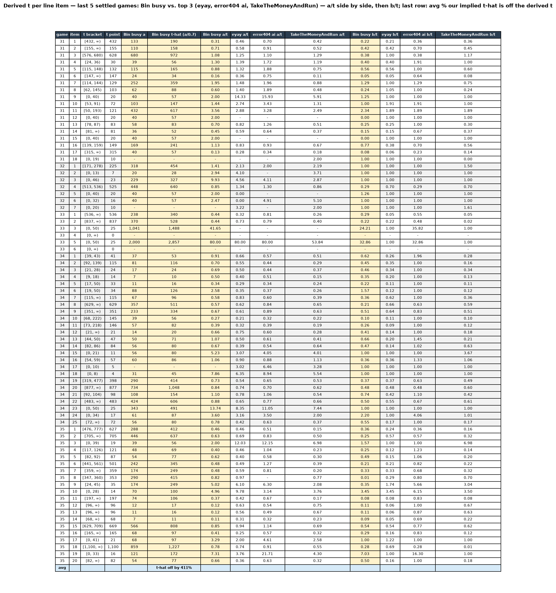
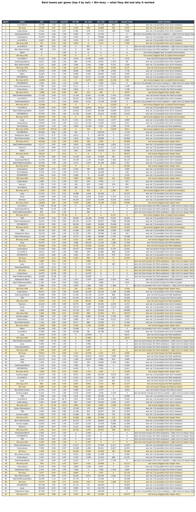

# Case Analysis — Number Tables

The number-only tables, regenerated automatically with the same workflow as
[`dashboard.md`](dashboard.md).

## Derived t per line item — last 5 games

For every line item: the derived t bracket/point, Bin busy's Charge and implied t-hat
(a/0.7 — our submission isn't public, only our Charge is). All a/t values side by side
(us then top 3), then all b/t values side by side. Last row: on average, how far (in %)
our implied t-hat was off the derived t. Full data in `data/tvalues.csv`.

## Best teams per game — what to copy

Top 3 by net each game (+ Bin busy's row highlighted): income split (fair accepts /
swallowed Overcharges / 1.5a penalties), cost leaks, Charge aggressiveness (med a/t),
and a one-line verdict of why it worked. Full per-team data in `data/teams.csv`.

