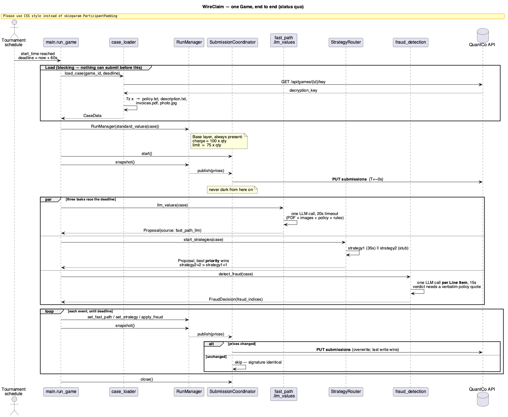
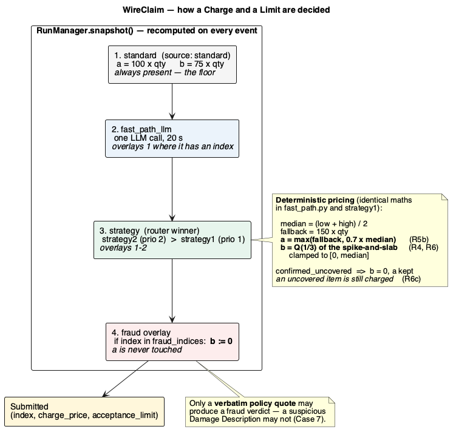

# Architecture

> **Stack:** Python 3.12 · asyncio · OpenAI-compatible LLM client · 7-Zip · pixi
>
> An event-driven runner for a 60-second tournament window. A **layered Proposal merge**
> turns three concurrent producers into one Submission, and a debounced coordinator keeps
> the API's last-write-wins semantics on our side.
>
> **This document is the reference for modules, layer contracts, the pricing maths and the
> merge semantics.** [`../CLAUDE.md`](../CLAUDE.md) carries the rules and conventions;
> [`../README.md`](../README.md) proves the tournament arithmetic (R1–R10).

---

## Contents

- [Diagrams](#diagrams) · [Module map](#module-map)
- [The 60-second contract](#the-60-second-contract) — what may block, what may not
- [The Proposal merge](#the-proposal-merge) — four layers, one invariant
- [The pricing engine](#the-pricing-engine) — evidence → posterior → `(a, b)`
- [The fraud gate](#the-fraud-gate) — why a quote is required
- [Submission semantics](#submission-semantics) · [Known seams](#known-seams-and-open-questions)

---

## Diagrams

Two PlantUML sources in [`diagrams/`](diagrams/), rendered to `.svg` and `.png`.
Regenerate with `plantuml -tsvg docs/diagrams/*.puml`.

### 1 — One Game, end to end



**Reading the diagram.** Loading is the only blocking phase: no Submission is possible
until the key is fetched and the archive is decrypted, because we do not know the Line
Item indices before then. The moment `CaseData` exists, `standard_values` publishes — so
the window from load to first Submission is the only time we are exposed to the default
`(0, 0)`. Everything after is an overwrite. The three producers race independently; none
can block another, and any of them may fail without stopping the rest.

### 2 — How a Charge and a Limit are decided



**Reading the diagram.** `RunManager.snapshot()` is a pure function of four pieces of
state, recomputed from scratch on every event. Layers 1–3 overlay by Line Item index;
layer 4 is not a layer of prices but a *mask* that only ever writes `b := 0`.

---

## Module map

| Module | Owns |
| --- | --- |
| `main.py` | `run_game` orchestration, `RunManager` merge state, the event loop, the deadline, `watch_games` / `retry_expired_games` |
| `src/api/tournament.py` | `list_games`, key fetch, `submit_prices` — the only code that talks to QuantCo |
| `src/api/llm.py` | client and model resolution (Azure/OpenAI env conventions) |
| `src/data/case_loader.py` | key → `7z` → `policy.txt`, `description.txt`, `invoices.pdf`, images → `CaseData` |
| `src/data/models.py` | `LineItem`, `CaseData`, `ItemPrice`, `Proposal`, `FraudDecision` — frozen dataclasses, no behaviour beyond `with_limit` / `to_submission_dict` |
| `src/services/submission_coordinator.py` | debounced async submitter; dedupes by price signature |
| `src/services/strategy_router.py` | runs strategies concurrently, keeps the highest-**priority** Proposal |
| `src/services/strategies/fast_path.py` | `standard_values` (sync floor) + `llm_values` (one 20 s call) |
| `src/services/strategies/strategy1/` | evidence-based estimator, 35 s, the live strategy |
| `src/services/strategies/strategy2/` | **stub — the slot we are building into** |
| `src/services/strategies/strategy3/` | Strategy-1-equivalent pipeline using the fixed `luna` model override |
| `src/services/fraud_detection.py` | per-Line-Item coverage/relatedness verdict, 15 s each |
| `src/services/t_calc.py`, `src/policy_digest.py` | supporting estimation helpers |

---

## The 60-second contract

Everything is scheduled against a single `deadline = loop.time() + 60`.

| Phase | Blocking? | Budget |
| --- | --- | --- |
| key fetch + `7z` + PDF parse | **yes** — nothing can submit before it | as fast as possible |
| `standard_values` + first `PUT` | no | ~immediate after load |
| `fast_path.llm_values` | no | 20 s LLM timeout |
| `strategy1` | no | 35 s LLM timeout |
| `strategy3` | no | 35 s LLM timeout, fixed `luna` override |
| `fraud_detection` | no | 15 s per Line Item, all items concurrent |
| every later `PUT` | no | bounded by `deadline - now` |

**The rule the design enforces:** *no producer may delay a Submission.* Each result is an
event; each event recomputes the snapshot and republishes. A producer that times out
simply never contributes.

> **The 60-second window cannot be extended.** `GET /api/games/{id}/key` returns `403`
> before `start_time`. What the design removes is everything *around* it — all 100
> archives are already on disk, so the only network call at T0 is the key fetch.

---

## The Proposal merge

`RunManager.snapshot()`, four layers, applied in order:

| # | Layer | Source | Contributes |
| --- | --- | --- | --- |
| 1 | standard | `standard_values` | `a = 100 × qty`, `b = 75 × qty`, every Line Item |
| 2 | fast path | `fast_path_llm` | overlays 1 where it has an index |
| 3 | strategy | router winner | overlays 1–2 |
| 4 | fraud mask | `FraudDecision` | `b := 0` on flagged indices |

**Three invariants, and they are the reason the merge is safe:**

1. **Layer 1 is never absent.** `RunManager` raises if the standard Proposal is empty, so
   every Line Item always has a number. This is what keeps us off the `(0, 0)` default,
   which is not a zero score but a bleed (README R7).
2. **Higher layers may only *overlay indices that layer 1 already knows*** — `snapshot()`
   filters on `valid_indices`. A model hallucinating Line Item 99 cannot inject one.
3. **The fraud mask only ever writes `b`.** `a` is whatever the highest contributing layer
   said. This is deliberate: an uncovered item has `t = 0`, so the honest branch pays
   nothing and a rejected Overcharge costs nothing — charging is weakly dominant
   (README R6c). Game 3 confirmed it: two teams charged on an all-uncovered Case and took
   ~400 each while the rest of the Field scored 0.

**Strategy priority.** `STRATEGY_PRIORITIES = {"strategy1": 1, "strategy2": 2, "strategy3": 3}`, and
`register()` rejects a proposal whose priority is *lower* than the incumbent's. So order of
completion does not matter: strategy3 wins whenever it produces a non-empty Proposal. An
unrecognised `source` string maps to priority `0` and loses to all three.

---

## The pricing engine

`fast_path.llm_values`, `strategy1` and `strategy3` follow [ADR 0001](brainstorm/sebi/adr/0001-the-model-reads-the-engine-prices.md):
**the model returns evidence, never a price.** The prompts say so explicitly, and the
response schema has no field for a Charge, a Limit or a Fair Value.

Evidence per Line Item: `coverage_probability`, `relatedness_probability`,
`coverage_clause`, `exclusion_quote`, `quantity`, `unit`, `trade`, `price_low`,
`price_high`, `anchors`.

Deterministic code then computes:

```python
median   = (low + high) / 2
fallback = FALLBACK_ESTIMATE * quantity          # 150 x qty

charge   = max(fallback, 0.7 * median)           # R5b: ~0.7 x the median Estimate

# Limit: a spike-and-slab posterior — mass (1-p) at zero, the band above it
zero_mass = 1 - covered_probability
if LIMIT_QUANTILE <= zero_mass:                  # 1/3
    limit = low * LIMIT_QUANTILE
else:
    q     = (LIMIT_QUANTILE - zero_mass) / covered_probability
    limit = low + q * (high - low)
limit = clamp(limit, 0, median)                  # R4/R6: bottom third, never above median
```

**Why these constants.** `0.7` is R5b — charging at the median forfeits the claim half the
time, so the optimum sits well below it. `1/3` is R4 — accept only at ≥ ⅔ confidence, which
makes the Limit the one-third quantile. The `clamp(…, 0, median)` is what stops the Game 5
and Game 7 failure mode, where an unbounded `b` produced 99–100 % of our costs from
accepting.

**Coverage defaults to high.** `covered = max(model_probability, 0.9)` unless
`confirmed_uncovered`. Only 2 of 17 Line Items in Game 5 were genuinely uncovered; an
invoice is ordinarily honest work, and a false "uncovered" costs twice — we forfeit the
Charge *and* fund the Field's Charges on the same item.

---

## The fraud gate

`fraud_detection.detect_fraud` runs one LLM call **per Line Item**, concurrently,
with a strict JSON schema. A verdict of "not covered" survives only if
**all three** hold:

1. `covered` or `related` is false, **and**
2. `confidence ≥ 0.85`, **and**
3. `exclusion_quote` is a **verbatim substring of `policy.txt`** (case- and
   whitespace-normalised), **at least 60 characters long**, and **contains exclusion
   language** from `EXCLUSION_MARKERS` — checked in code by `_is_policy_quote`.

Rule 3 is the load-bearing one. Case 7 dangles *"a couple of metres from the hob"* in the
Damage Description while the policy states that proximity to another appliance **does not**
remove cover. A model reasoning from the description alone excludes a fully covered item;
a model required to quote the policy cannot. The prompt says it in terms: *"A suspicious
detail in the Damage Description is not an exclusion."*

`strategy1` applies the same substring test independently, combined with
`coverage_probability < 0.5 or relatedness_probability < 0.5`, to set
`confirmed_uncovered`.

**Why 60 characters and a marker list.** The original gate asked only for a 12-character
substring, which against a ~63,000-character policy is no test at all: `"the schedule"`,
`"is not covered"` and `"the policyholder"` all passed. It verified that the quote
*existed*, not that it *proved an exclusion*. Game 10 flagged every Line Item, `b` went to
0 across the board, and the wrongful-rejection penalties came to 65,806.

The two added conditions come from the policies themselves. Splitting all 14 extracted
`policy.txt` files into sentences containing exclusion language gives a median length of
**112 characters**, and nearly every one under 60 is a *heading* — `"3.1 general
exclusions"`, `"3.2 exclusions within the fire group"` — which names a section without
excluding anything. A 60-character floor drops the headings and keeps 81 % of real clauses.

**The all-flagged circuit breaker.** `detect_fraud` discards its own verdict when it flags
*every* Line Item of a Case with 3 or more of them. This is a count and not a share on
purpose: settled Games 1–13 carry only **2–4 Line Items each** (max index 4), so any
percentage threshold is decided by rounding — at 35 % of 4 items, a single legitimate
second flag would be thrown away. Cases of 2 are exempt because a genuinely
whole-uncovered Case exists (Game 3, `t = 0` on both items). Tripping the breaker is cheap:
it falls back to the Strategy's own posterior Limit, never to an unbounded one.

---

## Submission semantics

`PUT /api/games/{id}/submissions` is **upsert, last-write-wins**, so republishing is free
and the design leans on it hard.

`SubmissionCoordinator` is a single-consumer worker over a "latest wins" slot:

- `publish()` computes a **signature** — the sorted `(index, charge, limit)` tuple — and
  drops the update if it equals the pending one.
- The worker skips a submit whose signature equals the last *submitted* one, so identical
  snapshots cost no request.
- Submits run in a thread with `timeout=deadline - now`; a failure is logged and the
  signature is **not** marked submitted, so the next event retries it.
- `close()` cancels the worker at the deadline.

Omitted Line Items default to `(0, 0)` **and still participate in Transactions** — the
handbook is explicit. Hence invariant 1 above.

### The blind floor

`run_game` publishes `blind_floor()` — `STANDARD_CHARGE` / `STANDARD_LIMIT` on indices 1–40
— **before it tries to load the Case**, and the floor stands if the load fails.

This is the single highest-value line in the runner. Games 11 and 12 submitted nothing and
scored −36,017 and −43,381, *identical to the teams that never showed up at all*, because
`(0, 0)` is not a neutral score: it charges nothing and wrongfully rejects every fair
claim at `1.5a`. Game 13, where the pipeline did run, cost only −2,607. Uptime, not
accuracy, is what the last four Games were decided on.

The index range is fixed at 40 because the Line Item count is unknowable before the Case
loads. The validated local corpus contains up to 39 Line Items (Game 8); indices past the
real count are accepted and ignored. `RunManager.snapshot()` drops the surplus once the
Case is in.

---

## Known seams and open questions

Recorded rather than fixed; each is a real decision, not an oversight.

1. **The pricing maths exists twice.** `fast_path.py` and `strategy1/strategy.py` both
   carry `CHARGE_FACTOR`, `LIMIT_QUANTILE`, `FALLBACK_ESTIMATE` and the spike-and-slab
   formula. They are identical today and nothing keeps them so. This is the one place a
   silent divergence would be expensive — a shared `pricing.py` is the obvious seam.
2. **`charge = max(fallback, 0.7 × median)` has a floor, not just a default.** On a
   genuinely cheap Line Item — settled Fair Values run as low as ~42 — the floor of
   `150 × qty` puts the Charge above `t`, which earns nothing. It costs nothing either
   (R5), but it forfeits the guaranteed income a smaller Charge would have collected.
3. **Two independent coverage verdicts.** `fraud_detection` and `strategy1` ask nearly the
   same question with different thresholds (0.85 confidence vs 0.5 probability). They can
   disagree; when they do, `strategy1` owns `a` and `fraud_detection` owns `b`.
4. **Betterment and quantity inflation are prompt-level, not schema-level.** Both prompts
   instruct the model to price the pre-loss standard and the plausible quantity, but no
   evidence field records that it did, so neither is verifiable or measurable after the
   fact.
5. **`strategy2` remains the open slot.** Priority 2, currently returns `None`. Strategy 3
   is a Strategy-1-equivalent Luna comparison track at priority 3.

---

## Service tier smoke test

`fast_path`, `strategy1`, and `strategy3` pass the resolved OpenAI service tier to their
Responses requests. The default is `fast`; set `AZURE_OPENAI_SERVICE_TIER=priority` to use
the tested priority tier instead. Verify a deployment without touching the tournament API:

```bash
pixi run python scripts/test_service_tier.py --tier fast
pixi run python scripts/test_service_tier.py --tier priority --model gpt-5.6-terra
```

The script tests both Chat Completions and Responses. It prints only model, route, tier,
latency, and API errors; it never prints credentials or sends a Game submission.
