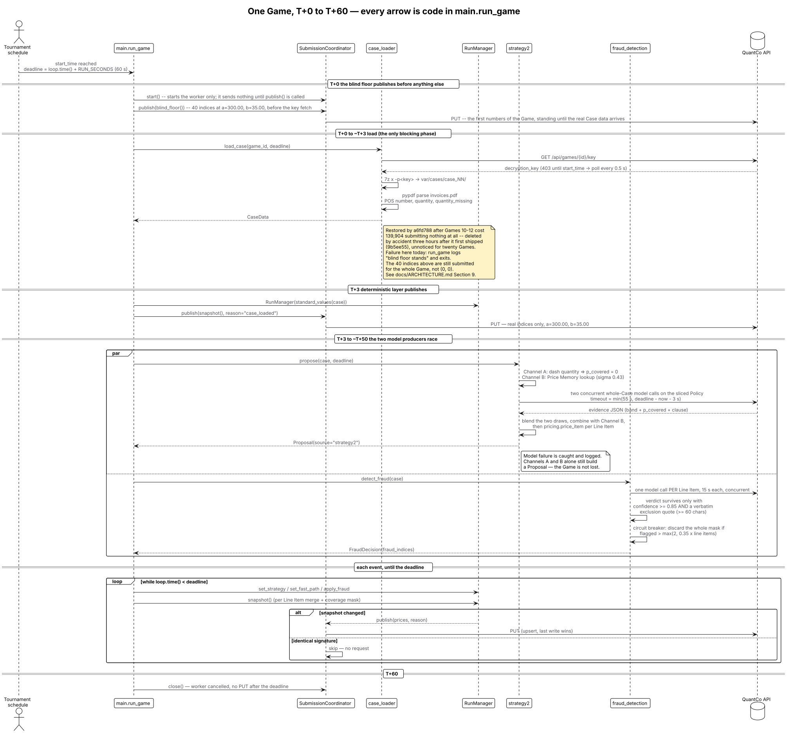
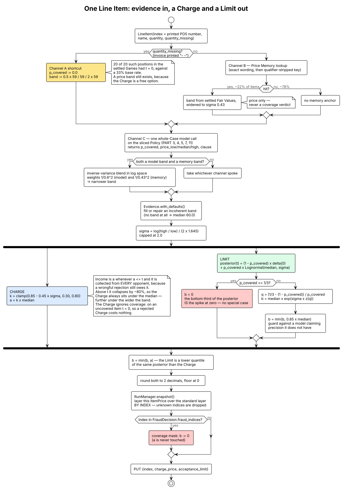

# Architecture

> **Stack:** Python 3.12 · asyncio · 7-Zip · pypdf · an OpenAI-compatible LLM client · pixi
>
> Read this front to back once and you will know what the runner does in every second of a
> Game, where each number it submits comes from, and what happens when a piece of it fails.
> It assumes you are a competent engineer who has never seen this repo.
>
> Related reading, in the order you will want it: [`GAME_DESCRIPTION.md`](GAME_DESCRIPTION.md)
> is the organisers' rulebook, [`CONTEXT.md`](CONTEXT.md) fixes the vocabulary,
> [`../CLAUDE.md`](../CLAUDE.md) carries the working rules, and
> [`../README.md`](../README.md) proves the tournament arithmetic. The design this document
> describes was written up in
> [`brainstorm/sebi/strats/review/strategy2-plan.md`](brainstorm/sebi/strats/review/strategy2-plan.md);
> where the shipped code and that plan disagree, the disagreements are listed in
> [Legacy and known weaknesses](#9-legacy-and-known-weaknesses).

---

## Contents

1. [What this system does](#1-what-this-system-does)
2. [The economics that dictate the design](#2-the-economics-that-dictate-the-design)
3. [One Game, second by second](#3-one-game-second-by-second)
4. [How a Charge and a Limit are decided](#4-how-a-charge-and-a-limit-are-decided)
5. [The three estimation channels](#5-the-three-estimation-channels)
6. [The coverage detector contract](#6-the-coverage-detector-contract)
7. [Invariants](#7-invariants)
8. [How we measure ourselves](#8-how-we-measure-ourselves)
9. [Legacy and known weaknesses](#9-legacy-and-known-weaknesses)

---

## 1. What this system does

Every ~12.6 minutes the tournament publishes an encrypted Case: an insurance policy, a
damage description, and an invoice whose positions carry no prices. We have **sixty
seconds** ([`main.py`](../main.py), `RUN_SECONDS = 60.0`) to fetch the decryption key,
unpack the archive, read all three documents, and submit **two numbers for every Line
Item** — a **Charge** `a`, the price we invoice every other team for that position, and an
**Acceptance Limit** `b`, the most we are willing to pay when another team invoices us the
same position. Behind each Line Item sits a secret **Fair Value** `t` that we never see,
and a secret payment Cap `c ≥ 4t`. Our score is the sum over every ordered pair of teams of
what we earned as Issuer minus what we paid as Reviewer, so the same two numbers are graded
sixteen times from each side, unattended, a hundred times over a weekend.

---

## 2. The economics that dictate the design

Everything in this repo is downstream of one table. From
[`GAME_DESCRIPTION.md`](GAME_DESCRIPTION.md) (`H` is the issuing handyman, `I` the
reviewing insurer, accept means `a ≤ b`):

|                            | `a ≤ t` — the price is fair       | `a > t` — the price is fraudulent          |
| -------------------------- | --------------------------------- | ------------------------------------------ |
| **`a ≤ b`, price accepted** | `I` pays `a`, `H` gets `a`        | `I` pays `min(a, c)`, `H` gets `min(a, c)` |
| **`a > b`, price rejected** | `I` pays `1.5a`, `H` gets `a`     | `I` pays `0`, `H` gets `0`                 |

Stare at the left column and the first design fact falls out.

**Fact one — income is a cliff at `t`, not a slope.** In the fair column the Issuer gets
`a` in *both* rows. Whether the Reviewer accepts or wrongfully rejects, `H` is owed its
money; rejecting merely adds a `0.5a` lawyer penalty on top, paid by the Reviewer. So a
Charge at or below `t` is collected from **every single opponent**, guaranteed, sixteen
times. One euro above `t` and both cells in the right column pay `H` nothing unless some
opponent's Limit happens to be loose enough to buy the overcharge. That is not a smooth
trade-off; it is a cliff, and we have measured how tall it is on our own settled Charges
(module docstring of [`src/pricing.py`](../src/pricing.py), and §0 of the
[strategy plan](brainstorm/sebi/strats/review/strategy2-plan.md)):

| our `a / t` | opponents who pay | expected income |
| ----------- | ----------------: | --------------: |
| ≤ 1.0       |        all 16     |    **1.00 × t** |
| 1.0 – 1.3   |            17 %   |      0.20 × t   |
| 1.3 – 2.0   |             7 %   |      0.15 × t   |

An Overcharge forfeits roughly **80 %** of the income the same item would have paid if
charged honestly. This is why the engine never Overcharges on purpose and why the Charge is
deliberately placed *below* our best estimate of `t` — the expected value we are maximising
is `k · P(t ≥ k · t̂)`, not `t̂` itself.

**Fact two — the accept/reject decision has a hard threshold at two thirds.** Read the same
table down the Reviewer's column. Accepting costs `a` (whatever the truth). Rejecting costs
`1.5a`, but *only in the fair row* — a rightful rejection is free. So accepting is the
better bet exactly when

```
a  <  1.5a · P(the Charge is fair)      ⟺      P(fair) > 2/3
```

Our Limit is therefore the value below which we still believe with two-thirds confidence
that the Charge is fair: the **one-third quantile of our posterior over `t`**. That is
README's "bottom third" with a proof attached rather than a heuristic, and it is why
[`src/pricing.py`](../src/pricing.py) has `LIMIT_QUANTILE = 1.0 / 3.0` and no tuning knob
next to it.

The two facts pull in opposite directions and that is the whole game: the Charge wants to
be low enough to always be paid, the Limit wants to be low enough never to fund an
Overcharge, and both are quantiles of the same distribution — which is why the pipeline's
real output is not two numbers but **one posterior per Line Item**.

---

## 3. One Game, second by second



**Reading the diagram.** Time runs down. Only one band is blocking — the load — and every
band below it is an overwrite of something already submitted. `PUT /api/games/{id}/submissions`
is an upsert with last-write-wins semantics, so republishing is free and the design leans on
that hard: we submit early and often rather than once and correctly.

### T+0 — the blind floor, published before the Case exists

`run_game` starts the [`SubmissionCoordinator`](../src/services/submission_coordinator.py)
and immediately publishes `blind_floor()`: `BLIND_LINE_ITEMS = 40` indices, each carrying
`STANDARD_CHARGE = 300.00` and `STANDARD_LIMIT = 35.00`
([`main.py`](../main.py), [`fast_path.py`](../src/services/strategies/fast_path.py)). This
happens *before* the key fetch, because the alternative is not a zero.

A Line Item we never submit defaults to `(0, 0)`, and `(0, 0)` is a bleed, not a neutral
result: charging nothing forfeits all income, and a Limit of zero wrongfully rejects every
fair claim in the field at `1.5a` each. Games 11 and 12 went out that way and cost 36,017
and 43,381 — identical to the teams that never showed up at all (comment in
[`main.py`](../main.py)). Together with Game 10 that failure mode has cost 139,904.

Forty is chosen because the Line Item count is unknowable before the Case loads. Settled
Games 1–14 carry 2, 2, 6, 6, 7, 12, 13, 15, 16, 17, 17, 18, 23 and 39 Line Items, so 40
covers every Case seen so far with a slot of headroom; indices past the real count create no
Transactions and are accepted by the API. *(This constant was 8 for one commit, on a reading
of `/transactions` that stopped at the first page of 100 rows. Page to the end of every API
list.)*

**If this fails:** the `PUT` throws, the coordinator logs it and does *not* mark the
signature submitted, so the next event retries. Until a retry lands we are exposed to the
`(0, 0)` default — this is the only window in the whole minute where that is true.

### T+0 to ~T+3 — key, archive, invoice

[`case_loader.load_case`](../src/data/case_loader.py) does three things in sequence, all
deadline-bounded:

1. `GET /api/games/{id}/key`. Before `start_time` the endpoint returns `403`, so
   `get_released_key` polls every 0.5 s until it succeeds or the deadline passes. This is
   the only network round-trip we cannot remove — all 100 archives are already committed to
   the repo, so nothing else has to be downloaded at T+0.
2. `7z x -p<key>` into `var/cases/case_NN/`, giving `policy.txt`, `description.txt`,
   `invoices.pdf` and any images.
3. `read_invoice_line_items` extracts the PDF text with `pypdf` and `parse_invoice_text`
   turns it into `LineItem`s. Two details there are load-bearing rather than cosmetic. The
   **index is the printed POS number**, taken verbatim from the invoice, including gaps —
   Case 11's invoice has no POS 12 and the settled Game correspondingly has indices 1–11 and
   13–23, so renumbering by row ordinal would misalign every Transaction. And a position
   whose quantity and unit columns contain only dashes is recorded as
   `quantity_missing=True` instead of collapsing into `quantity = 1.0`, because that dash is
   the single strongest free signal in the Case (see [§5](#5-the-three-estimation-channels)).

**If this fails:** `run_game` catches it, logs *"blind floor stands"*, waits for the
coordinator to drain and exits. We finish the Game on 40 plausible numbers rather than on
nothing. If the load succeeds but only *after* the deadline, the run is abandoned without
submitting — the coordinator refuses to `PUT` past the deadline.

### T+3 — the deterministic layer publishes

The moment `CaseData` exists, `RunManager` is constructed around `standard_values(case)` —
the same flat `(300.00, 35.00)` per Line Item, now on the *real* index set — and a second
`PUT` goes out with `reason="case_loaded"`. From here on the surplus blind indices are gone
and every subsequent submission is a refinement.

`RunManager` refuses to be constructed with an empty standard Proposal. That is the
mechanical guarantee behind [invariant 1](#7-invariants): there is never a moment after the
Case loads at which some Line Item has no number.

### T+3 to ~T+50 — the model call on the sliced Policy

[`strategy2.propose`](../src/services/strategies/strategy2/strategy.py) runs, dispatched
through [`StrategyRouter`](../src/services/strategy_router.py). It first collects everything
knowable for free (Channels A and B, [§5](#5-the-three-estimation-channels)), then makes
**one model call for the whole Case** — one call, not one per item, so the model sees
neighbouring positions and can notice duplicates, an inflated quantity, or a sub-limit that
applies across several lines.

The prompt is handed a **sliced** Policy. [`policy_slice.slice_policy`](../src/policy_slice.py)
keeps only `PART 3` (exclusions), `4` (insured property), `5` (insured costs), `7`
(calculation of the indemnity) and `11` (the claim-specific loss description), which is
about 41 % of a 35k–65k-character document. The slice is **verbatim** — never reflowed,
never whitespace-normalised — because downstream code checks that a quoted clause is a
character-exact substring of the Policy. It fails *open*: a document with no recognisable
`PART` headers, or a slice that comes out under `MIN_SLICE_CHARS = 2000`, returns the full
text rather than blinding the estimator. This slicer replaced a ~20-second blocking LLM
"policy digest" with zero latency, which is where most of the room for the model call came
from.

The model's timeout is `min(40 s, deadline − now − 2 s)`, so it can never eat the two
seconds the final `PUT` needs.

**If this fails** — timeout, malformed JSON, no `items` list, an API error — the exception
is caught and logged at warning level, and `build_proposal` runs anyway on Channels A and B
alone. A model failure downgrades the numbers; it does not forfeit the Game.

### The merge — per Line Item, on every event

Each producer result is pushed onto an `asyncio.Queue` as a `RunEvent`; the main loop pops
events until the deadline and recomputes `RunManager.snapshot()` after each one.
`snapshot()` is a pure function of four pieces of state, recomputed from scratch every time:

| # | Layer      | Source                | Contributes                                      |
| - | ---------- | --------------------- | ------------------------------------------------ |
| 1 | standard   | `standard_values`     | `(300.00, 35.00)` on every real Line Item        |
| 2 | fast path  | `fast_path_llm`       | overlays layer 1 **by index** (legacy — see §9)  |
| 3 | strategy   | router winner         | overlays layers 1–2 **by index**                 |
| 4 | coverage   | `FraudDecision`       | a *mask*: writes `b := 0` on flagged indices     |

The overlay is per Line Item, not per Case: a Proposal that only prices indices 3 and 7
improves exactly those two and leaves the rest of the snapshot alone. Higher layers may only
write indices that layer 1 already knows (`snapshot()` filters on `valid_indices`), so a
model that hallucinates a Line Item 99 cannot inject one.

Priorities live in [`strategy_router.py`](../src/services/strategy_router.py):
`STRATEGY_PRIORITIES = {"strategy1": 1, "strategy3": 2, "strategy2": 3}`. `register()`
rejects any proposal whose priority is below the incumbent's, so completion order does not
matter — Strategy 2 wins whenever it produces anything, because it is the only estimator
whose constants are fitted to reconstructed Fair Values and the only one that cannot return
nothing.

### T+50 to T+60 — the coverage mask and the final PUT

[`fraud_detection.detect_fraud`](../src/services/fraud_detection.py) has been running
concurrently since T+3, one 15-second model call per Line Item, all fired at once. Its
verdicts arrive as a `FraudDecision`, and applying it zeroes the Limit on the flagged
indices — and only the Limit. `a` is never touched, for the reason in
[§4](#4-how-a-charge-and-a-limit-are-decided).

Every changed snapshot is republished. `SubmissionCoordinator` computes a **signature** —
the sorted `(index, charge, limit)` tuple — and skips both a publish identical to the
pending one and a submit identical to the last one actually sent, so an unchanged snapshot
costs no request. A failed submit is logged and the signature is *not* recorded as
submitted, so the next event naturally retries it. At the deadline `close()` cancels the
worker; nothing is sent afterwards.

**If the coverage detector fails:** individual item failures are logged and skipped; the
whole gather is wrapped so one exception cannot take the rest down. If the gate flags more
than `max(2, 0.35 × line_items)` positions, the entire verdict is discarded — see
[§6](#6-the-coverage-detector-contract).

---

## 4. How a Charge and a Limit are decided



**Reading the diagram.** Follow one Line Item from the top. The left-hand branch is the
free deterministic shortcut; the middle is the memory lookup; everything converges on a
single `Evidence` record, and the fork near the bottom is the only place where the Charge
and the Limit part company. Both are read off the same distribution.

[`src/pricing.py`](../src/pricing.py) is the **only** module in the repo that decides a
number we are scored on. Nothing that talks to a model is allowed to emit a Charge, a Limit
or a Fair Value — models emit `Evidence` (a coverage probability, a price band, a quoted
clause) and this module prices it. That is
[ADR 0001](brainstorm/sebi/adr/0001-the-model-reads-the-engine-prices.md), and it exists so
that two regenerations over the same invoice cannot disagree about what we submit.

### The posterior

One distribution per Line Item, with coverage folded in as probability mass at zero:

```
posterior(t)  =  (1 − p_covered) · δ(0)  +  p_covered · Lognormal(median = t̂, σ)
```

`σ` is not invented. It is read out of the band the model returned, treating that band as a
90 % interval: `implied_sigma(low, median, high) = log(high / low) / (2 × 1.645)`, capped at
2.0. The band is the only honest uncertainty signal we get, and it drives both numbers — a
model that is unsure returns a wide band, which pushes both the Charge and the Limit further
below the median.

### The Charge

```python
k = clamp(0.85 − 0.45 × σ, 0.30, 0.80)
a = k × median
```

The linear rule reproduces three simulated optima: `k ≈ 0.7` at `σ = 0.25`, `0.6` at `0.5`,
`0.5` at `0.75` — the value of `k` that maximises `k · P(t ≥ k · t̂)` against the settled
Fair Value distribution. The worse our estimate, the further under the median we have to aim
to stay on the paying side of the cliff.

**The Charge deliberately ignores coverage.** That is not an oversight, it is free money. If
an item turns out to be uncovered then `t = 0`, so the honest branch pays nothing and a
rejected Overcharge costs nothing — a Charge on an uncovered item is a free option. Shading
it down "for doubt" forfeits guaranteed income on everything that *is* covered. Game 3 is
the proof: every Line Item was uncovered, two teams charged ~100 anyway and were paid by 2 of
16 opponents, and the rest of the field scored zero.

### The Limit, and why coverage needs no special case

The Limit is the one-third quantile of the *whole* posterior — including the spike at zero.
Write it out and the special case disappears:

```python
if p_covered <= 1/3:
    b = 0.0                                        # the bottom third IS the spike
else:
    q = (1/3 − (1 − p_covered)) / p_covered        # strip the zero mass, re-normalise
    b = median × exp(σ × z(q))
    b = min(b, 0.85 × median)                      # LIMIT_CEILING
b = min(b, a)
```

If an item is only, say, 50 % likely to be covered, then half the posterior's mass already
sits at zero, so the value with one third of the mass below it *is* zero. `b = 0` falls out
of the arithmetic. There is no threshold in the code that says "if uncertain, reject" —
`COVERAGE_FLOOR` is named only so the boundary shows up in logs and tests. This is the
correct answer often: about 40 % of settled Line Items (76 of 192 in Games 1–14) have
`t = 0`, and paying anything on one of those is a pure loss.

Two guards sit on top. `LIMIT_CEILING = 0.85` caps the Limit at 85 % of the median, because
the quantile rule trusts the band and a model returning `95–105` on an item worth 20 would
otherwise have us accept nearly the full median; it binds only below `σ ≈ 0.38`, so at
realistic widths the band still drives the number. And `b ≤ a` always holds, since the Limit
is a lower quantile of the same posterior than the Charge.

One empirical shading is worth knowing: the 2/3 rule prices an accepted Overcharge at `a`,
but the Cap allows `min(a, c)` with `c ≥ 4t`, so accepting is in truth slightly worse than
the rule assumes. The ceiling absorbs that.

**Why the Limit gets the paranoia and the Charge gets the optimism.** In Game 5 our Limit
was effectively outside the posterior: we accepted 246 of 272 Transactions, 99 % of our costs
came from accepting, and we paid 1,121.40 on a Line Item whose Fair Value was under 773.50.
Net −10,604. A Limit outside the posterior is not a flat knob, it is an open tap. Game 17
repeated the lesson from the other side: a bug that floored every coverage probability at
0.9 meant the Limit could never collapse, we paid 70,736 on accepted invoices for a net of
−63,789, while two leaders made +18,577 and +24,141 on the same Case.

### Missing evidence

`Evidence.with_defaults()` repairs an incoherent band rather than rejecting it: a missing
median is taken from whatever values exist, a missing low becomes `median × 0.5`, a missing
high `median × 2`, and an item with no usable numbers at all falls back to
`FALLBACK_MEDIAN = 60.0` — the median Fair Value over the 148 settled Line Items with a
bounded bracket. That fallback is deliberately low, because our historic failure has been
Charging *above* `t`: our median `a / t` has been 1.06 where the leaders sit at 0.73–0.85.

---

## 5. The three estimation channels

`t̂` comes from three sources of very different quality, and they are ranked by how much we
trust them rather than by how impressive they are.

**Channel A — deterministic, free, instant.** A position whose quantity and unit columns
print only dashes is worth nothing: **20 of 20** such Line Items across the settled Games
have `t = 0`, against a base rate of 33 %. There is no cheaper signal in the pipeline. The
parser preserves it as `quantity_missing`, Channel A turns it into `p_covered = 0.0`, and
`price_item` is additionally called with `confirmed_uncovered=True` — belt and braces, so
that no later blend can talk the item back into being covered. It still receives a plausible
price band, because the Charge on a worthless item is free. The same channel owns the Policy
slicer and the rule that the index is the printed POS number.

**Channel B — Price Memory, an anchor and not an answer.**
[`src/price_memory.py`](../src/price_memory.py) holds the Fair Values reconstructed from
settled Games, keyed on the normalised Line Item wording. Measured leave-one-out over Cases
1–14 (each Case scored against a store built from the other thirteen) it reaches **22 %** of
the items with a known non-zero Fair Value at **σ = 0.43**. That is good enough to narrow a
band and not good enough to settle a price on its own, so a hit is folded in as one estimate
among several.

Three measured details explain the shape of that module. Storing an hourly, per-metre,
per-m² or per-kilogram position **per unit** and multiplying by the queried quantity on
lookup — while `pcs` and `flat rate` stay gross totals — took σ from **0.659 to 0.431**;
extending per-unit treatment further made it worse. Fuzzy matching is a trap: a Jaccard
nearest-neighbour lifts recall but wrecks σ (0.72 at threshold 0.7, 1.19 at 0.25), so
matching is exact wording plus one qualifier-stripped fallback key and nothing looser. And
the raw spread of one to three past prices contained the true Fair Value only **42 %** of the
time, so the returned band is widened to at least the measured σ, which gets it to 65 % — two
observations that happen to agree are a small sample, not a tight posterior.

Crucially, **Price Memory supplies price only, never coverage.** Six of the fifteen wordings
that repeat across Cases flip between `t = 0` and `t > 0`; `vehicle costs` is worthless in
several Cases and worth tens to hundreds in others. Coverage is a property of *this* Case's
Policy, so it is always decided from the Case at hand.

**Channel C — the model, carrying the other ~78 %.** Channel A only speaks about items worth
zero and Channel B reaches a fifth of the rest, so the model is not a fallback: it is the
load-bearing estimator. It returns evidence only — `coverage_probability`, a gross-total
`price_low / price_median / price_high` band, and the deciding clause quoted verbatim. Its
own σ is **not yet measured**; `MODEL_SIGMA_PRIOR = 0.6` is a stated guess used only to
weight it against Price Memory when both speak, and it is the single most important number
still missing from this system.

When both a model band and a memory band exist for the same index, `_combine` does an
inverse-variance blend in log space with weights `1/0.6²` and `1/0.43²`. Two independent
estimates of the same quantity are worth more than either, and blending them *narrows* the
band, which raises both the Charge and the Limit toward the estimate — the mechanism by which
better evidence turns directly into more money.

The prompt itself is a piece of engineering worth reading in full in
[`strategy.py`](../src/services/strategies/strategy2/strategy.py). It states the level
anchors explicitly (tradesman labour at roughly 60–110 EUR/hour multiplied by the hours;
small parts and consumables genuinely in the tens; equipment hire, drying, leak detection and
disposal typically 50–400; appliances and structural work into the low thousands), gives the
settled distribution as a shape check (a quarter under 20 EUR, median around 59, top decile
past 400), and tells the model that pricing an expensive item like the median is the most
expensive single mistake available to it. It also encodes the two coverage traps: judge the
**service being billed, not the object it concerns** (an inspection is frequently indemnified
even when the inspected property is not), and read cross-references to the end (a clause
ending *"the head of cost under 5.2.6 remains unaffected"* is a pointer to cover, not an
exclusion).

---

## 6. The coverage detector contract

Coverage is a separate job from pricing, and the seam between them is one field. The
contract, written up in
[`anforderungen-markus.md`](brainstorm/sebi/strats/review/anforderungen-markus.md), is:

**per Line Item, a probability `p_covered ∈ [0, 1]` that the Policy indemnifies this
position at all, plus the deciding clause quoted verbatim** — at least 60 characters,
character-exact from `policy.txt`, validated with
[`policy_quote.is_policy_quote()`](../src/policy_quote.py). Not a boolean. When nothing was
found, the answer is `0.9` (cover is the normal case), not `0.5`. The index is the printed
POS number, gaps kept.

**Why a boolean is lossy.** §4 showed that the Limit is a quantile of a distribution that
includes `(1 − p_covered)` mass at zero. A probability slots straight into that and the
Limit collapses on its own below one third. A boolean throws away exactly the middle of the
range — and the middle is the only region where the decision is actually in doubt. A `1` on
an item you are 60 % sure about reads as "pay in full", which is wrong; a `0` on an item you
are 60 % sure about forfeits the guaranteed income on a covered position *and* makes us the
field's paymaster. The measured cost of that information loss is Game 17: a bug that pinned
every coverage probability to at least 0.9 meant the Limit could never collapse, we paid
70,736 on accepted invoices and netted −63,789 on a Case where two leaders made +18,577 and
+24,141.

A boolean detector is still accepted, with a documented mapping: `1 → p_covered = 0.9`;
`0` **with** a valid quote → `0.0`; `0` **without** a valid quote → discarded, back to `0.9`.

Two things the detector may never do. It may **never set `a` to zero** — an uncovered item
has `t = 0`, so charging is free (Game 3 again). And it may **never block the Submission**;
it runs concurrently and a late verdict overwrites by `PUT`, because Games 10–12 cost 139,904
between them by submitting nothing at all.

The shipped implementation, [`fraud_detection.py`](../src/services/fraud_detection.py), is
the strict end of that contract: one model call per Line Item under a strict JSON schema, and
a verdict of "not covered" survives only if all three of `covered or related is false`,
`confidence ≥ 0.85`, and `is_policy_quote(exclusion_quote, policy_text)` hold. The quote test
is the load-bearing one. It requires the quote to be at least 60 characters, to contain actual
exclusion language, and to appear verbatim in the Policy. Sixty is measured: splitting all 14
extracted policies into sentences containing exclusion language gives a median clause length
of 112 characters, and nearly everything under 60 is a *heading* — "3.1 general exclusions" —
which names a section without excluding anything. The floor drops the headings and keeps ~81 %
of real clauses. The earlier 12-character test let `"the schedule"` and `"the policyholder"`
pass; Game 10 flagged every Line Item as a result and the wrongful-rejection penalties came to
65,806.

The quote requirement also defends against the Cases that are built as traps. Case 7 dangles
*"a couple of metres from the hob"* in the Damage Description while the Policy says in terms
that proximity to another appliance does **not** remove cover. A model reasoning from the
description excludes a fully covered item; a model required to quote the Policy cannot. The
prompt states it flatly: *a suspicious detail in the Damage Description is not an exclusion.*

Finally, a **circuit breaker**: if the gate flags more than `max(2, 0.35 × line_items)`
positions, the whole verdict is discarded rather than zeroing that many Limits. The share is
the right denominator because Cases run from 2 to 39 Line Items, and the floor of 2 exists
because genuinely all-uncovered small Cases exist (Game 3 has two Line Items, both worth
nothing) and a share alone would overrule a correct verdict there. Tripping the breaker is
cheap: we fall back to Strategy 2's own posterior Limit, never to an unbounded one.

A detector can grade itself, which is the best part of this seam:
`scripts/invert_fair_values.py` gives the true `t = 0` set for 192 settled Line Items. The
base rate is ~40 % but it ranges from **0 % to 67 % per Case** — Case 12 has no uncovered
items at all, Case 10 has 4 of 6 — so there is no safe global prior. Calibrate per Case; a
detector that always finds something to exclude is simply wrong on Case 12.

---

## 7. Invariants

These are the properties that must hold for every submission, in every Game. Each one is
enforced somewhere in code, and each one is the residue of a specific loss.

1. **Never `a = 0`.** A Charge of zero forfeits income that was guaranteed, and it is never
   the right answer even on an item we believe is uncovered, because `t = 0` makes the
   Charge a free option. The coverage mask writes `b` only; `price_item` computes the Charge
   before it looks at coverage at all.
2. **Never `b` above `t̂`, never unbounded.** The Limit is a lower quantile of the same
   posterior as the Charge, hard-capped at `0.85 × median` and then at `a`. An unbounded
   Limit produced 99 % of our costs in Game 5.
3. **Never absent.** `RunManager` refuses an empty standard layer, the blind floor covers the
   window before the Case loads, and every failure path in `run_game` leaves the last
   successful submission standing. Uptime outranks accuracy: break-even uptime against a dumb
   bot that never misses is ~71 %.
4. **Always gross totals, always for the whole Line Item.** Never net (a factor of 1.19),
   never per-unit (a factor of the quantity, often 10–30×). The prompt says it twice; Price
   Memory's per-unit store multiplies back up to a gross total on lookup precisely so that
   this invariant survives its quantity handling.
5. **Index = the printed invoice POS number, gaps included.** Never renumber by row ordinal.
   Case 11's invoice skips POS 12 and so does the settled Game.

---

## 8. How we measure ourselves

The unusual luxury of this tournament is that **the secret Fair Value is exactly
recoverable** from settled Games, so nothing here has to be argued from intuition.

[`scripts/invert_fair_values.py`](../scripts/invert_fair_values.py) does the reconstruction,
with no model involved. The payoff table leaks `t` directly: a rejected Transaction that
still carries a non-zero amount is a wrongful rejection, which reveals the Issuer's Charge
*and* proves `a ≤ t`; a rejected Transaction at zero proves `a > t`. Per Line Item that gives
`t ≥ max{wrongfully rejected charges}` and `t < min{rightfully rejected charges}`. Run with
`--verify` it replays the payoff table over the reconstruction and reproduces every published
team-Game net to the cent, which is what makes the ground truth trustworthy rather than
plausible.

[`scripts/replay_payoffs.py`](../scripts/replay_payoffs.py) answers the counterfactual that
matters — *what would our net have been in Game g if we had submitted `(a, b)` instead?* —
holding every opponent's real behaviour fixed. It self-checks by reproducing all fourteen of
our published nets before it is trusted. Its output is the reason we are confident about the
Charge multiplier: blurring a perfect estimate by a known log-noise gives

| σ    | net over 14 Games, `a = t̂` | net over 14 Games, `a = 0.7 · t̂` |
| ---: | --------------------------: | --------------------------------: |
| 0.35 |                    +74,796  |                      **+131,497** |
| 0.50 |                    +37,483  |                       **+89,807** |
| 0.75 |                     −8,894  |                       **+31,725** |
| 1.00 |                    −48,914  |                          −20,915  |

`a = 0.7 · t̂` beats `a = t̂` at every σ ≥ 0.1 — the Charge-below-the-estimate rule confirmed
on a validated harness rather than asserted.

[`scripts/backtest.py`](../scripts/backtest.py) is the offline gate. It scores any estimator
callable against Cases 1–14, caches leaderboard reconstruction and PDF extraction on disk so
re-tuning the deterministic layer costs nothing, and reports three things: **σ**, the standard
deviation of `log(t̂ / t_mid)`, overall and per channel; the **coverage confusion** against
the true `t = 0` set; and the **simulated net per Game** through `replay_payoffs`.

**σ is the gate on everything.** Two warnings come with it, and both are in the code rather
than in someone's head. Score with total log error, not a bare standard deviation — a stdev
cannot see a level error, and our actual failure mode is a *bias* (median `a/t` of 1.06 where
it should be ~0.7); by the plain-stdev definition every constant estimator scores an identical
1.77. And σ is computed on the **148 of 192** Line Items whose bracket is bounded above. A
bracket is bounded only when somebody was rightfully rejected on that item, so the 44 excluded
ones are those nobody ever rightfully rejected — plausibly the expensive tail. **Every σ we
quote is optimistic.**

Where break-even sits is itself a measured quantity with an open disagreement, and it is worth
knowing about rather than papering over: the payoff replay puts it at **σ ≈ 0.85** with
`a = 0.7 · t̂`, while `backtest.py`'s own blurred-oracle sweep puts it at **~0.75** with
`a = t̂` and **~0.9** with `a = 0.7 · t̂`. An older figure of 0.35 came from a cruder model
that proxied `t` with the field's median Charge and credited nothing for accepted Overcharges;
treat 0.35 as the target and ~0.85 as the crossing. Price Memory's 0.43 clears the crossing
comfortably; a blind constant does not.

After every settled Game, recompute and append to `field-findings.md`: σ overall and per
channel, the coverage confusion against the true `t = 0` set, income against the two cost
sides, and the accept share. Never tune a knob whose error you have not measured, and never
carry a field measurement across a phase boundary — the tournament has three regimes (an awake
and generous field early, a mostly dark middle, a recalibrated field at the end) and a `p`
estimated in one is worthless in the next.

---

## 9. Legacy and known weaknesses

**Legacy, being retired.** `strategies/strategy1`, `strategies/strategy3`,
`fast_path.llm_values` and `services/t_calc.py` are the previous generation: two more
whole-Case estimators, an early LLM fast path, and a Fair Value helper. They still run —
`strategy1` and `strategy3` as a free ensemble and disagreement signal, `llm_values` as
merge layer 2 — but Strategy 2 outranks all of them and none of their constants are fitted to
reconstructed Fair Values. They are documented nowhere else in this file on purpose. Two
things must be untangled before they can be deleted: `strategy2` still imports
`build_input_content` from `strategy1`, and `main.run_game` still imports and launches
`llm_values` directly.

**Known weaknesses, honestly stated.**

- **The model's σ is unmeasured.** Everything else here is fitted; `MODEL_SIGMA_PRIOR = 0.6`
  is not. If the true value lands above 0.5, the right response is to lean harder on Channels
  A and B and keep `b` near zero.
- **The coverage detector in the live path is still a boolean.** §6 specifies `p_covered` as a
  probability, but `fraud_detection.py` emits a set of flagged indices, and the `p_covered`
  that actually reaches the posterior comes from Strategy 2's own Channel C. A probability-
  emitting replacement, `src/services/coverage.py`, exists in the tree but is not yet imported
  by `main.py` or by Strategy 2; until it is wired in, the contract seam is a design document
  rather than a running interface.
- **`fast_path.llm_values` still contributes numbers.** As merge layer 2 it fills any index
  Strategy 2 did not price — with a coverage probability floored at 0.9, which is the exact
  shape of the Game 17 bug. It is bounded by `STANDARD_LIMIT`, so the blast radius is small,
  but it is the wrong arithmetic sitting in a live path.
- **A whole Proposal is replaced, not accumulated.** `RunManager.set_strategy` swaps the whole
  Strategy layer, so a later, *smaller* Proposal from the same layer drops indices an earlier
  one had priced. Layer 1 backstops those items, so nothing goes to `(0, 0)`, but the design
  plan calls for an item-wise accumulating layer and this is not it.
- **Per-item model calls were planned and are not implemented.** The plan's timeline fires
  per-item calls alongside the whole-Case call so one slow item costs one item. The shipped
  strategy makes a single whole-Case call; if it times out, Channels A and B carry the Case.
- **Two "settled median" constants disagree by one euro.** `SETTLED_MEDIAN = 59.0` in
  `strategy2/strategy.py` and `FALLBACK_MEDIAN = 60.0` in `pricing.py` are described in
  identical terms. Harmless today; the kind of duplication that has already cost us money once.
- **Channel C's evidence schema is being extended as this is written.** Work in flight adds a
  per-unit rate (`unit_rate_*`, multiplied by the printed quantity) and a coarse `magnitude`
  class that can only widen a band upward, both aimed at the underpriced tail. The Evidence →
  price arithmetic in §4 is unaffected; only what the model is asked for changes.
- **The Cap `c` has never bound** in 52,224 settled rows, so we only know `c > max observed
  accepted amount`. Any plan leaning on large Charges extrapolates past the data.

---

## Appendix — regenerating the diagrams

Sources live in [`diagrams/`](diagrams/) and are rendered to both `.svg` (used in this
document) and `.png`:

```bash
plantuml -tsvg docs/diagrams/*.puml
plantuml -tpng -SdpiScale=2 docs/diagrams/*.puml
```

| Source | Rendered | Shows |
| --- | --- | --- |
| `01-game-timeline.puml` | [svg](diagrams/01-game-timeline.svg) · [png](diagrams/01-game-timeline.png) | one Game on the 60-second clock, with the deadline and every fallback |
| `02-line-item-decision.puml` | [svg](diagrams/02-line-item-decision.svg) · [png](diagrams/02-line-item-decision.png) | evidence → posterior → `(a, b)` for one Line Item |
| `03-components.puml` | [svg](diagrams/03-components.svg) · [png](diagrams/03-components.png) | modules and dependency direction |
