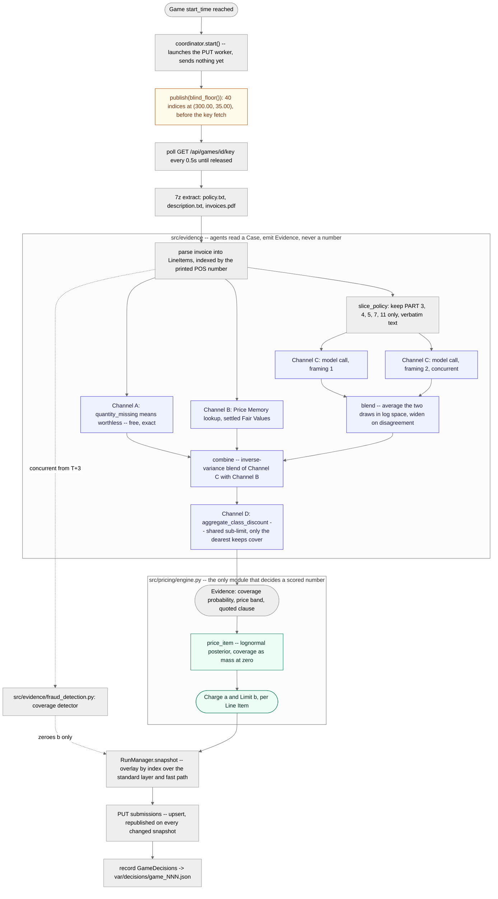
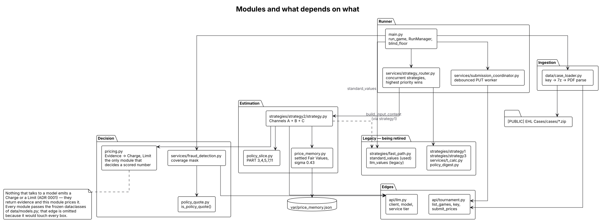

# Architecture

> **Stack:** Python 3.12 · asyncio · 7-Zip · pypdf · an OpenAI-compatible LLM client · pixi
>
> Read this front to back once and you will know what the runner does in every second of a
> Game, where each number it submits comes from, and what happens when a piece of it fails.
> It assumes you are a competent engineer who has never seen this repo.
>
> Related reading, in the order you will want it: [`GAME_DESCRIPTION.md`](GAME_DESCRIPTION.md)
> is the organisers' rulebook, [`CONTEXT.md`](CONTEXT.md) fixes the vocabulary,
> [`../CLAUDE.md`](../CLAUDE.md) carries the working rules, and
> [`GAME-AND-PROOFS.md`](GAME-AND-PROOFS.md) proves the tournament arithmetic. The design this document
> describes was written up in
> [`brainstorm/sebi/strats/review/strategy2-plan.md`](brainstorm/sebi/strats/review/strategy2-plan.md);
> where the shipped code and that plan disagree, the disagreements are listed in
> [Legacy and known weaknesses](#9-legacy-and-known-weaknesses).

---

## Contents

1. [What this system does](#1-what-this-system-does)
2. [One Game, front to back](#2-one-game-front-to-back)
3. [The economics that dictate the design](#3-the-economics-that-dictate-the-design)
4. [How a Charge and a Limit are decided](#4-how-a-charge-and-a-limit-are-decided)
5. [The three estimation channels, and one discount pass over them](#5-the-three-estimation-channels-and-one-discount-pass-over-them)
6. [The coverage detector contract](#6-the-coverage-detector-contract)
7. [Invariants](#7-invariants)
8. [How we measure ourselves](#8-how-we-measure-ourselves)
9. [Legacy and known weaknesses](#9-legacy-and-known-weaknesses)

---

## 1. What this system does

Every ~12.6 minutes the tournament publishes an encrypted Case: an insurance policy, a
damage description, and an invoice whose positions carry no prices. We have **sixty
seconds** ([`main.py`](../main.py), `RUN_SECONDS = 60.0`) to fetch the decryption key,
unpack the archive, read all three documents, and submit **two numbers for every Line
Item** — a **Charge** `a`, the price we invoice every other team for that position, and an
**Acceptance Limit** `b`, the most we are willing to pay when another team invoices us the
same position. Behind each Line Item sits a secret **Fair Value** `t` that we never see,
and a secret payment Cap `c ≥ 4t`. Our score is the sum over every ordered pair of teams of
what we earned as Issuer minus what we paid as Reviewer, so the same two numbers are graded
sixteen times from each side, unattended, a hundred times over a weekend.

---

## 2. One Game, front to back

This section is the whole pipeline, once, in order: key fetch, Case load, Policy slice, the
three evidence channels, blend, combine, `price_item`, a Charge and a Limit, the two-phase
Submission, and the decision log. Everything after this section goes deeper on one piece of
it; nothing here is the last word on any of them.



**Reading the diagram.** Solid arrows are the main line; dotted arrows are things that run
alongside it rather than on it — the coverage detector, which only ever *removes* by zeroing
a Limit. The amber box is the blind floor: forty plausible numbers published before the key
fetch even starts, so a Case that never loads still leaves something standing rather than
nothing (§9 has the history of why this box was missing from an earlier version of this
diagram, and what it cost). The two tinted boxes are
[ADR 0001](brainstorm/sebi/adr/0001-the-model-reads-the-engine-prices.md)'s whole argument
drawn as a boundary: everything indigo reads the Case and can only produce `Evidence`; the
one green box is the only place in the repo allowed to turn that evidence into a number we
are scored on.

### T+0 — the blind floor publishes before anything else

`run_game` starts the [`SubmissionCoordinator`](../src/runtime/submission_coordinator.py) at
T+0, and starting it only launches its background worker — nothing is actually sent until
something calls `.publish(...)`. The very next line does: `coordinator.publish(blind_floor())`,
before the key fetch has even started. [`blind_floor()`](../main.py) returns
`BLIND_LINE_ITEMS = 40` indices at a flat `(300.00, 35.00)` — the same constants as
[`standard_values`](../src/strategies/fast_path.py) — so the first `PUT` of every Game goes
out at T+0, before we know the Line Item count, the Policy, or whether the Case will load at
all.

That number, 40, is not arbitrary: the Line Item count is unknowable before the Case loads,
and settled Games 1–14 carried at most 39 — one more than the observed maximum, so a real
index is never left uncovered. If the Case then loads, the real prices overwrite these within
a second at essentially no cost (submission is an upsert; last write wins). If it does *not*
load, this is the difference between a bad Game and no Game at all.

**Why this line exists, and why it is worth a whole subsection.** Games 11 and 12 submitted
nothing at all and scored −36,017 and −43,381 — identical to a team that never showed up,
because `(0, 0)` is a bleed, not a neutral result: charging nothing forfeits all income, and a
Limit of zero wrongfully rejects every fair claim in the field at `1.5a` each. Together with
Game 10 that failure mode cost 139,904
(`docs/brainstorm/sebi/strats/review/live-changelog.md`). Commit `b5ba5dc` fixed it for Games
13 onward with exactly this mechanism. Three hours later the same day, commit `9b5ee55` ("Keep
submissions observable through strategy deadlines") deleted `blind_floor()`,
`BLIND_LINE_ITEMS`, and the `coordinator.publish(blind_floor())` call along with them — nothing
about that commit's message mentioned the removal, and this document still described the
mechanism as running for twenty Games after it was gone. As shipped in that window, a
Case-load failure submitted nothing for the whole Game — the exact bleed Games 10–12 had
already cost 139,904 to teach us to close.

Commit `a6fd788` ("Restore the blind floor, deleted by accident twenty Games ago") put it back,
which is the state this document now describes. [§9](#9-legacy-and-known-weaknesses) keeps the
full incident record — how a 112-line refactor's commit message can delete a safety net
without saying so, and how two tests written in the same commit matched the new behaviour
without anyone noticing a behaviour had changed.

### T+0 to ~T+3 — key, archive, invoice

[`case_loader.load_case`](../src/data/case_loader.py) does three things in sequence, all
deadline-bounded:

1. `GET /api/games/{id}/key`. Before `start_time` the endpoint returns `403`, so
   `get_released_key` polls every 0.5 s until it succeeds or the deadline passes. This is
   the only network round-trip we cannot remove — all 100 archives are already committed to
   the repo, so nothing else has to be downloaded at T+0.
2. `7z x -p<key>` into `var/cases/case_NN/`, giving `policy.txt`, `description.txt`,
   `invoices.pdf` and any images.
3. `read_invoice_line_items` extracts the PDF text with `pypdf` and `parse_invoice_text`
   turns it into `LineItem`s. Two details there are load-bearing rather than cosmetic. The
   **index is the printed POS number**, taken verbatim from the invoice, including gaps —
   Case 11's invoice has no POS 12 and the settled Game correspondingly has indices 1–11 and
   13–23, so renumbering by row ordinal would misalign every Transaction. And a position
   whose quantity and unit columns contain only dashes is recorded as
   `quantity_missing=True` instead of collapsing into `quantity = 1.0`, because that dash is
   the single strongest free signal in the Case — Channel A, below.

**If this fails:** `run_game` catches it, logs *"blind floor stands"*, waits for the
coordinator to drain and exits — accurately, because the T+0 publish above is still the last
thing sent for this Game: 40 plausible numbers, not nothing (see above). If the load succeeds
but only *after* the deadline, the run is abandoned without submitting further — the
coordinator refuses to `PUT` past the deadline, so whatever was last published (still the
blind floor, if nothing else ever ran) stands.

### T+3 — the deterministic layer publishes

The moment `CaseData` exists, `RunManager` is constructed around `standard_values(case)` —
the same flat `(300.00, 35.00)` per Line Item, now on the *real* index set — and the first
`PUT` of the Game goes out, with `reason="case_loaded"`. Every subsequent submission from
here on is a refinement of this one, not a replacement of an earlier blind one — there is no
earlier one.

`RunManager` refuses to be constructed with an empty standard Proposal. That is the
mechanical guarantee behind [invariant 3](#7-invariants): there is never a moment after the
Case loads at which some Line Item has no number.

### T+3 to ~T+50 — evidence, then price

[`strategy2.propose`](../src/strategies/strategy2/strategy.py) runs, dispatched through
[`StrategyRouter`](../src/strategies/router.py), and does exactly what
[ADR 0001](brainstorm/sebi/adr/0001-the-model-reads-the-engine-prices.md) asks, in one
function: gather evidence, then price it. Nothing before `price_item` is allowed to compute
a Charge or a Limit.

After Strategy 2 records that evidence, Strategy 5 may produce a lower-priority comparison
without another model call. It maps the same combined median through coarse magnitude tiers
to one Fair-Value point and submits it as both Charge and Limit (`a = b`). It never replaces
Strategy 2 in the live priority order; its decision log is accumulated for counterfactual
validation.

**Channels A and B, free and instant.**
[`channels.local_evidence`](../src/strategies/strategy2/channels.py) walks every Line Item
before any network call: a position whose quantity and unit print as a dash is Channel A's —
`worthless_evidence`, priced as `t = 0` — and everything else gets a Channel B lookup against
[Price Memory](../src/evidence/memory.py), the Fair Values reconstructed from settled Games.
Both cost nothing and both finish before the model is even asked.

**Channel C, the model, in two framings at once.**
[`model.request_evidence`](../src/strategies/strategy2/model.py) makes **one whole-Case call
per framing** — not one call per Line Item, so the model sees neighbouring positions and can
notice duplicates, an inflated quantity, or a sub-limit that applies across several lines —
against a **sliced** Policy.
[`policy_slice.slice_policy`](../src/evidence/policy/slice.py) keeps only `PART 3`
(exclusions), `4` (insured property), `5` (insured costs), `7` (calculation of the indemnity)
and `11` (the claim-specific loss description), about 41 % of a 35k–65k-character document,
**verbatim** — never reflowed, never whitespace-normalised — because downstream code checks
that a quoted clause is a character-exact substring of the Policy. It fails *open*: no
recognisable `PART` headers, or a slice under `MIN_SLICE_CHARS = 2000`, returns the full text
rather than blinding the estimator. It replaced a ~20-second blocking LLM "policy digest"
with zero latency, which is where most of the room for two model calls came from. Both
framings run concurrently, so the wall clock is one call, not two; each is capped at
`min(LLM_TIMEOUT_SECONDS = 55 s, deadline − now − SUBMISSION_RESERVE_SECONDS = 3 s)`, so a
draw can never eat the three seconds the final `PUT` needs.

**Blend, then combine — two different merges that answer two different questions.**
[`blend.blend`](../src/strategies/strategy2/blend.py) merges the **ensemble**: the same Case
read twice, in two framings, averaged in log space and widened wherever the two draws
disagree, rather than trusting whichever band the model happened to assert. Then
[`blend.combine`](../src/strategies/strategy2/blend.py) merges the **channels**: that blended
Channel C reading against Channel B's memory anchor, two genuinely independent estimates of
the same quantity, inverse-variance-weighted in log space — narrowing the band, which pushes
both the Charge and the Limit up toward the estimate. Channel A never enters this blend: an
item Channel A already priced at zero is confirmed uncovered and passed straight through.

**Then, and only then, price it.** The merged `Evidence` — one coverage probability, one
price band, one quoted clause — goes to [`price_item`](../src/pricing/engine.py), the one
function in the repo allowed to compute a Charge and a Limit; [§4](#4-how-a-charge-and-a-limit-are-decided)
has the exact arithmetic. `build_proposal` records one `ItemDecision` per Line Item as it
goes — which channels spoke, what evidence was priced, what came out — and once every Line
Item has a price, [`decisions.record`](../src/runtime/decisions.py) writes the whole Game to
`var/decisions/game_NNN.json`. That file is what `pixi run learn` reads once the Game
settles, to name *which stage* was wrong rather than only how much was lost.

**If this fails** — timeout, malformed JSON, no `items` list, an API error, on either
framing — the exception is caught and logged at warning level, and `build_proposal` runs
anyway on Channels A and B alone. A model failure downgrades the numbers; it does not
forfeit the Game.

### The outer merge — per Line Item, on every event

A different merge from blend/combine above: this one runs once per *Proposal*, across the
whole layer stack, not once per `Evidence`. Each producer result is pushed onto an
`asyncio.Queue` as a `RunEvent`; the main loop pops events until the deadline and recomputes
`RunManager.snapshot()` after each one. `snapshot()` is a pure function of four pieces of
state, recomputed from scratch every time:

| # | Layer      | Source                | Contributes                                      |
| - | ---------- | --------------------- | ------------------------------------------------ |
| 1 | standard   | `standard_values`     | `(300.00, 35.00)` on every real Line Item        |
| 2 | fast path  | `fast_path_llm`       | overlays layer 1 **by index** (legacy — see §9)  |
| 3 | strategy   | router winner         | overlays layers 1–2 **by index**                 |
| 4 | coverage   | `FraudDecision`       | a *mask*: writes `b := 0` on flagged indices     |

The overlay is per Line Item, not per Case: a Proposal that only prices indices 3 and 7
improves exactly those two and leaves the rest of the snapshot alone. Higher layers may only
write indices that layer 1 already knows (`snapshot()` filters on `valid_indices`), so a
model that hallucinates a Line Item 99 cannot inject one.

Priorities live in [`src/strategies/__init__.py`](../src/strategies/__init__.py). Strategy 2
is priority 4; the Strategy 5 coherent Fair-Value comparison is immediately below it at 3,
and Strategy 4 plus the retired Strategy 3 are at 2. `register()` rejects any proposal whose
priority is below the incumbent's, so completion order does not matter. The default router
runs Strategy 5 and Strategy 4 only after Strategy 2 has completed, records their
counterfactuals, and never spends another model call on Strategy 5.

### T+50 to T+60 — the coverage mask and the final PUT

[`fraud_detection.detect_fraud`](../src/evidence/fraud_detection.py) has been running
concurrently since T+3, one 15-second model call per Line Item, all fired at once. Its
verdicts arrive as a `FraudDecision`, and applying it zeroes the Limit on the flagged
indices — and only the Limit. `a` is never touched, for the reason in
[§4](#4-how-a-charge-and-a-limit-are-decided).

Every changed snapshot is republished. `SubmissionCoordinator` computes a **signature** —
the sorted `(index, charge, limit)` tuple — and skips both a publish identical to the
pending one and a submit identical to the last one actually sent, so an unchanged snapshot
costs no request. A failed submit is logged and the signature is *not* recorded as
submitted, so the next event naturally retries it. At the deadline `close()` cancels the
worker; nothing is sent afterwards.

**If the coverage detector fails:** individual item failures are logged and skipped; the
whole gather is wrapped so one exception cannot take the rest down. If the gate flags more
than `max(2, 0.35 × line_items)` positions, the entire verdict is discarded — see
[§6](#6-the-coverage-detector-contract).

### After T+60

The Game settles a minute or two later, its Transactions become public, and
`scripts/learn_from_game.py` joins them against the decision log this Game just wrote to say
which stage was wrong — see [§8](#8-how-we-measure-ourselves). Nothing above this line knows
that will happen; the decision log is written unconditionally, whether or not anyone ever
reads it.

### The same walkthrough, two other ways

The diagram at the top of this section is deliberately the simple version. Two more diagrams
go deeper on pieces of it:


This is the same walkthrough as a sequence diagram — every actor, every API call, every
failure path, laid out over the actual wall clock rather than as a pipeline shape.



And this is the static shape behind all of it: which `src/` package imports which, with the
same evidence/pricing boundary as the flowchart above, now as a dependency graph rather than
a run of one Game. `src/evidence/`, `src/pricing/`, `src/strategies/`, `src/legacy/` and
`src/runtime/` are current as of this document; see [§9](#9-legacy-and-known-weaknesses) for
what changed and why.

---

## 3. The economics that dictate the design

Everything in this repo is downstream of one table. From
[`GAME_DESCRIPTION.md`](GAME_DESCRIPTION.md) (`H` is the issuing handyman, `I` the
reviewing insurer, accept means `a ≤ b`):

|                            | `a ≤ t` — the price is fair       | `a > t` — the price is fraudulent          |
| -------------------------- | ---------------------------------- | ------------------------------------------ |
| **`a ≤ b`, price accepted** | `I` pays `a`, `H` gets `a`        | `I` pays `min(a, c)`, `H` gets `min(a, c)` |
| **`a > b`, price rejected** | `I` pays `1.5a`, `H` gets `a`     | `I` pays `0`, `H` gets `0`                 |

Stare at the left column and the first design fact falls out.

**Fact one — income is a cliff at `t`, not a slope.** In the fair column the Issuer gets
`a` in *both* rows. Whether the Reviewer accepts or wrongfully rejects, `H` is owed its
money; rejecting merely adds a `0.5a` lawyer penalty on top, paid by the Reviewer. So a
Charge at or below `t` is collected from **every single opponent**, guaranteed, sixteen
times. One euro above `t` and both cells in the right column pay `H` nothing unless some
opponent's Limit happens to be loose enough to buy the overcharge. That is not a smooth
trade-off; it is a cliff, and we have measured how tall it is on our own settled Charges
(module docstring of [`src/pricing/engine.py`](../src/pricing/engine.py), and §0 of the
[strategy plan](brainstorm/sebi/strats/review/strategy2-plan.md)):

| our `a / t` | opponents who pay | expected income |
| ----------- | ----------------: | --------------: |
| ≤ 1.0       |        all 16     |    **1.00 × t** |
| 1.0 – 1.3   |            17 %   |      0.20 × t   |
| 1.3 – 2.0   |             7 %   |      0.15 × t   |

An Overcharge forfeits roughly **80 %** of the income the same item would have paid if
charged honestly. This is why the engine never Overcharges on purpose and why the Charge is
deliberately placed *below* our best estimate of `t` — the expected value we are maximising
is `k · P(t ≥ k · t̂)`, not `t̂` itself.

**Fact two — the accept/reject decision has a hard threshold at two thirds.** Read the same
table down the Reviewer's column. Accepting costs `a` (whatever the truth). Rejecting costs
`1.5a`, but *only in the fair row* — a rightful rejection is free. So accepting is the
better bet exactly when

```
a  <  1.5a · P(the Charge is fair)      ⟺      P(fair) > 2/3
```

Our Limit is therefore the value below which we still believe with two-thirds confidence
that the Charge is fair: the **one-third quantile of our posterior over `t`**. That is
README's "bottom third" with a proof attached rather than a heuristic, and it is why
[`src/pricing/engine.py`](../src/pricing/engine.py) has `LIMIT_QUANTILE = 1.0 / 3.0` and no tuning knob
next to it.

The two facts pull in opposite directions and that is the whole game: the Charge wants to
be low enough to always be paid, the Limit wants to be low enough never to fund an
Overcharge, and both are quantiles of the same distribution — which is why the pipeline's
real output is not two numbers but **one posterior per Line Item**.

---

## 4. How a Charge and a Limit are decided


**Reading the diagram.** Follow one Line Item from the top. The left-hand branch is the
free deterministic shortcut; the middle is the memory lookup; everything converges on a
single `Evidence` record, and the fork near the bottom is the only place where the Charge
and the Limit part company. Both are read off the same distribution.

[`src/pricing/engine.py`](../src/pricing/engine.py) is the **only** module in the repo that decides a
number we are scored on. Nothing that talks to a model is allowed to emit a Charge, a Limit
or a Fair Value — models emit `Evidence` (a coverage probability, a price band, a quoted
clause) and this module prices it. That is
[ADR 0001](brainstorm/sebi/adr/0001-the-model-reads-the-engine-prices.md), and it exists so
that two regenerations over the same invoice cannot disagree about what we submit.

### The posterior

One distribution per Line Item, with coverage folded in as probability mass at zero:

```
posterior(t)  =  (1 − p_covered) · δ(0)  +  p_covered · Lognormal(median = t̂, σ)
```

`σ` is not invented. It is read out of the band the model returned, treating that band as a
90 % interval: `implied_sigma(low, median, high) = log(high / low) / (2 × 1.645)`, capped at
2.0. The band is the only honest uncertainty signal we get, and it drives both numbers — a
model that is unsure returns a wide band, which pushes both the Charge and the Limit further
below the median.

### The Charge

```python
k = clamp(0.85 − 0.45 × σ, 0.30, 0.80)
a = k × median
```

The linear rule reproduces three simulated optima: `k ≈ 0.7` at `σ = 0.25`, `0.6` at `0.5`,
`0.5` at `0.75` — the value of `k` that maximises `k · P(t ≥ k · t̂)` against the settled
Fair Value distribution. The worse our estimate, the further under the median we have to aim
to stay on the paying side of the cliff.

**The Charge deliberately ignores coverage.** That is not an oversight, it is free money. If
an item turns out to be uncovered then `t = 0`, so the honest branch pays nothing and a
rejected Overcharge costs nothing — a Charge on an uncovered item is a free option. Shading
it down "for doubt" forfeits guaranteed income on everything that *is* covered. Game 3 is
the proof: every Line Item was uncovered, two teams charged ~100 anyway and were paid by 2 of
16 opponents, and the rest of the field scored zero.

### The Limit, and why coverage needs no special case

The Limit is the one-third quantile of the *whole* posterior — including the spike at zero.
Write it out and the special case disappears:

```python
if p_covered <= 2/3:                                # COVERAGE_FLOOR = 1 - LIMIT_QUANTILE
    b = 0.0                                          # the bottom third IS the spike
else:
    q = (1/3 − (1 − p_covered)) / p_covered          # strip the zero mass, re-normalise
    ceiling = 0.75 if memory_backed else 0.45        # LIMIT_CEILING_MEMORY / LIMIT_CEILING
    candidates = [median × exp(σ × z(q)), ceiling × median]
    if not memory_backed:
        candidates.append(708.0)                     # LIMIT_CAP -- model-only items only
    b = min(candidates)
b = min(b, a)
```

If an item is only, say, 50 % likely to be covered, then half the posterior's mass already
sits at zero, so the value with one third of the mass below it *is* zero. `b = 0` falls out
of the arithmetic once the zero mass reaches two thirds — the bottom-third quantile is
entirely inside the spike whenever `p_covered <= 2/3`, which is what `COVERAGE_FLOOR` names.
There is no separate threshold in the code that says "if uncertain, reject". This is the
correct answer often: about 40 % of settled Line Items (76 of 192 in Games 1–14) have
`t = 0`, and paying anything on one of those is a pure loss.

Three guards sit on top, and the first two now come in two tiers rather than one, split on
whether **Channel B priced this item** — a wording seen in a settled Case, whose Fair Value
was recovered exactly rather than estimated. `LIMIT_CEILING = 0.45` caps a model-only Limit at
45 % of the median, because the quantile rule trusts the band and a model returning `95–105`
on an item worth 20 would otherwise have us accept nearly the full median. On a memory-backed
item that guardrail loosens to `LIMIT_CEILING_MEMORY = 0.75` — measured positive on all eight
fold cells (all/odd/even/early/late × two windows) through `replay_payoffs`, +40,791 over 37
Games — because the guard against a bad estimate is redundant when the estimate has already
been checked against a settled outcome. `LIMIT_CAP = 708` (12 × the *old* settled median of 59,
frozen as a literal on purpose — see [§9](#9-legacy-and-known-weaknesses)) caps a model-only
Limit in **euros**, which is the one thing a multiplier cannot do: when the estimate blows up,
a multiplicative ceiling blows up with it, and Game 29 bought thirteen opponents' Charges of
2,000.00 on an item worth under 57 for 24,157 of pure loss. That cap is now **lifted entirely
on memory-backed items**, because it was doing the wrong job there: Game 41's watch settled at
`t ≥ 11,131`, all ten of the field's Charges on it were fair, and the flat 708 cap held our
Limit down regardless — we rejected nine of ten and paid 1.5× on all of them, losing money a
correct estimate could have kept. Swept through `price_item` over Games 26–41, lifting the cap
on memory-backed items alone scores **−5,104** (i.e. saves that much) with zero additional
Overcharges admitted; lifting it everywhere costs **+21,503** in fresh Overcharges, almost all
from one model-only miss (Game 29's water-damaged boiler, estimated at 7,139 against a true
`t < 57`). The discriminator is the channel, not the euro amount. And `b ≤ a` always holds,
since the Limit is a lower quantile of the same posterior than the Charge.

The base ceiling has been re-opened twice and stays at 0.45 both times. Loosening it — for
every item, not only memory-backed ones — to 0.70 is worth +17,835 over 32 Games and is
positive in **32 of 32** leave-one-Game-out folds — and is still wrong, because leave-one-out
cannot see a regime change when 31 training Games stay in every fold. Split on *time* instead
(train on Games 1–25, score on 26+) and it scores **−2,274**; +17,218 of the +17,835 is Games
1–19, and every value above 0.45 loses on Games 28–32. The full table lives on the constant in
[`engine.py`](../src/pricing/engine.py). The memory-backed ceiling above is the one candidate
in that whole family that cleared every fold, which is why it shipped and the base ceiling did
not move.

One empirical shading is worth knowing: the 2/3 rule prices an accepted Overcharge at `a`,
but the Cap allows `min(a, c)` with `c ≥ 4t`, so accepting is in truth slightly worse than
the rule assumes. The ceiling absorbs that.

**Why the Limit gets the paranoia and the Charge gets the optimism.** In Game 5 our Limit
was effectively outside the posterior: we accepted 246 of 272 Transactions, 99 % of our costs
came from accepting, and we paid 1,121.40 on a Line Item whose Fair Value was under 773.50.
Net −10,604. A Limit outside the posterior is not a flat knob, it is an open tap. Game 17
repeated the lesson from the other side: a bug that floored every coverage probability at
0.9 meant the Limit could never collapse, we paid 70,736 on accepted invoices for a net of
−63,789, while two leaders made +18,577 and +24,141 on the same Case.

### Missing evidence

`Evidence.with_defaults()` repairs an incoherent band rather than rejecting it: a missing
median is taken from whatever values exist, a missing low becomes `median × 0.5`, a missing
high `median × 2`, and an item with no usable numbers at all falls back to
`FALLBACK_MEDIAN = 60.0` — the median Fair Value over the 148 settled Line Items with a
bounded bracket. That fallback is deliberately low, because our historic failure has been
Charging *above* `t`: our median `a / t` has been 1.06 where the leaders sit at 0.73–0.85.

---

## 5. The three estimation channels, and one discount pass over them

`t̂` comes from three sources of very different quality, and they are ranked by how much we
trust them rather than by how impressive they are. A fourth channel, D, does not add price
information of its own — it discounts what A–C already produced, for one specific and narrow
failure shape; it is covered at the end of this section rather than promoted to a fourth
source.

**Channel A — deterministic, free, instant.** A position whose quantity and unit columns
print only dashes is worth nothing: **20 of 20** such Line Items across the settled Games
have `t = 0`, against a base rate of 33 %. There is no cheaper signal in the pipeline. The
parser preserves it as `quantity_missing`, Channel A turns it into `p_covered = 0.0`, and
`price_item` is additionally called with `confirmed_uncovered=True` — belt and braces, so
that no later blend can talk the item back into being covered. It still receives a plausible
price band, because the Charge on a worthless item is free. The same channel owns the Policy
slicer and the rule that the index is the printed POS number.

**Channel B — Price Memory, an anchor and not an answer.**
[`src/evidence/memory.py`](../src/evidence/memory.py) holds the Fair Values reconstructed from
settled Games, keyed on the normalised Line Item wording. Measured leave-one-out over Cases
1–14 (each Case scored against a store built from the other thirteen) it reached **22 %** of
the items with a known non-zero Fair Value at **σ = 0.43**. That is good enough to narrow a
band and not good enough to settle a price on its own, so a hit is folded in as one estimate
among several.

**Re-measured over all 100 Games, that recall figure was four times too pessimistic, and it
stayed in this file and in the module docstring for most of the tournament.** The finished store
reaches **79 % (609/773) at σ = 0.458, bias +0.031**. Recall grows with the store, and the store
finished at 325 wordings from 1,161 joined Line Items. The consequence was not academic: it is
the sentence that justified treating a hit as a weak anchor, and replaying the tournament with
the finished store — letting a hit price the item outright — scores **+630,751 weighted**, first
place instead of fifth (`scripts/experiments/memory_first.py`, POSTMORTEM §5–6). What did *not*
follow is raising memory's share of the blend: swept walk-forward, the score falls monotonically
as the share rises above the shipped 0.66. The arithmetic was right; the store was wrong.

Four measured details explain the shape of that module. Storing an hourly, per-metre,
per-m² or per-kilogram position **per unit** and multiplying by the queried quantity on
lookup — while `pcs` and `flat rate` stay gross totals — took σ from **0.659 to 0.431**;
extending per-unit treatment further made it worse. Fuzzy matching is a trap: a Jaccard
nearest-neighbour lifts recall but wrecks σ (0.72 at threshold 0.7, 1.19 at 0.25), so
matching is exact wording plus one qualifier-stripped fallback key and nothing looser. And
the raw spread of one to three past prices contained the true Fair Value only **42 %** of the
time, so the returned band is widened to at least the measured σ, which gets it to 65 % — two
observations that happen to agree are a small sample, not a tight posterior.

The fourth is [`infer_unit`](../src/evidence/memory.py): two Line Items across Games 1–36
print a quantity with a genuinely blank unit column — `Skilled worker hours   14   -` — which
`normalise_unit` turns into `""` and `is_per_unit` then reads as false, so the position is
stored and queried as a *gross* total instead of an hourly rate, roughly 14× too large going
in and scaled by 1 instead of the real quantity coming out. Measured log error on both known
occurrences: **−2.61 and −2.64 before the fallback, +0.03 and −0.00 after.** `infer_unit`
fires only when the parsed unit is already blank and the wording itself names an hour — it
deliberately does not fire on the other dash-unit rows in the record, which are genuinely
gross-priced and where guessing a unit would be groundless.

Crucially, **Price Memory supplies price only, never coverage.** Six of the fifteen wordings
that repeat across Cases flip between `t = 0` and `t > 0`; `vehicle costs` is worthless in
several Cases and worth tens to hundreds in others. Coverage is a property of *this* Case's
Policy, so it is always decided from the Case at hand.

**Channel C — the model, carrying the other ~78 %.** Channel A only speaks about items worth
zero and Channel B reaches a fifth of the rest, so the model is not a fallback: it is the
load-bearing estimator. It returns evidence only — `coverage_probability`, a gross-total
`price_low / price_median / price_high` band, and the deciding clause quoted verbatim. Its
own σ **has since been measured**, and `MODEL_SIGMA_PRIOR = 0.6` — the weight used against
Price Memory when both speak — turns out to be close: graded on the logged Games against the
recovered Fair Values, the model-only channel scores RMSLE **0.76** and the memory-backed one
**0.48**, against asserted band widths of 0.39 and 0.35. So the model is overconfident by
about **1.9×** and Price Memory by 1.4×; the *ordering* the blend assumes is right, the
*calibration* of the band is not. Two cautions on those figures: they are computed on items
with a two-sided bracket, which exist only where somebody rightfully rejected and therefore
skew cheap, and the sample is small. Median `t̂/t` over both one- and two-sided brackets is
**0.99**, so the estimator is roughly median-unbiased and the apparent level error in the
per-Game digests is a censoring artefact, not a bias to correct.

When both a model band and a memory band exist for the same index, `combine` does an
inverse-variance blend in log space with weights `1/0.6²` and `1/0.43²`. One special case sits
in front of it: the model zeroes its band on items it judges uncovered — every zero-band Line
Item in the logged Games came back with `coverage ≤ 0.30` — and that used to discard the
memory anchor, dropping the item onto `FALLBACK_MEDIAN` so it was Charged a flat 39.62 whatever
it was worth. `combine` now keeps the model's coverage verdict, so the Limit still collapses,
and takes the anchor's band. Two independent
estimates of the same quantity are worth more than either, and blending them *narrows* the
band, which raises both the Charge and the Limit toward the estimate — the mechanism by which
better evidence turns directly into more money.

The prompt itself is a piece of engineering worth reading in full in
[`prompts.py`](../src/strategies/strategy2/prompts.py). It states the level anchors
explicitly, and those anchors are **measured against the settled Fair Values, not guessed**:
tradesman labour at roughly 60–110 EUR/hour multiplied by the hours; small parts and
consumables genuinely in the tens; leak detection and moisture surveys around 430 and reaching
850; drying around 425, or 1,400–2,600 large-area; assessment and inspection around 490;
disposal and strip-out around 130; appliances and structural work into the low thousands. The
band they replaced — a single "equipment hire, drying, leak detection and disposal typically
50–400" — was wrong on its two largest members, and the model anchored on it: our estimates on
the fourteen settled leak-detection items were 180…561, and sat **below the proven floor of
`t` on 11 of them**.

The prompt also gives the settled distribution as a shape check — and that hint itself was
wrong the same direction for the same reason. `_DISTRIBUTION_HINT` used to tell the model a
quarter of positions sit under 20 EUR, the median is 59, and the top decile "runs past 400 EUR
to several thousand." Re-measured over **457** settled Line Items rather than the 148 the old
figures came from: a quarter sit under **25**, the median is **97**, and `p90` is **616**, with
`p99` at 2,345 and the largest settled position seen so far at 11,131. Every one of those old
figures understated the true value, and understating a distribution to a model is not neutral —
it anchors low, hardest exactly on the expensive tail where the estimator is already worst:
Game 41's watch, declared on a valuables schedule, settled at `t ≥ 11,131` and was priced at
5,524. The corrected hint states the true quantiles and tells the model that pricing an
expensive item like the median is the single most expensive mistake available to it — pointedly,
because it is the one actually being made. It also encodes the two coverage traps: judge the
**service being billed, not the object it concerns** (an inspection is frequently indemnified
even when the inspected property is not), and read cross-references to the end (a clause
ending *"the head of cost under 5.2.6 remains unaffected"* is a pointer to cover, not an
exclusion).

### Channel D — a discount pass, not a fourth estimate

[`aggregate_class_discount`](../src/strategies/strategy2/channels.py) runs after `combine`,
over the whole Case rather than one Line Item at a time, and it only ever *lowers* a Limit —
never a Charge, never coverage. Some Policies put a whole class of property under **one**
shared sub-limit rather than one each: Policy 4.2.2, in every Case seen, puts valuables
(jewellery, watches, precious metals or stones) "in the aggregate per insured event across all
items," so a claim for three pieces can exhaust one pot even though each item individually
reads as covered.

Game 44 is the only Case in the corpus to show the collision, and it shows it cleanly: a watch
settled at `t ≥ 9,361` (paid), while a ring and a necklace on the same schedule settled at
`t < 884` and `t < 663` (both zero) — the watch alone exhausted the shared pot. The model priced
all three at an *identical* coverage probability of 0.925; it never noticed there was a pot to
exhaust, and a prompt fix tried first still failed on the Case it needed to fix. So this is the
deterministic replacement ADR 0001 asks for: when two or more matched members of a class both
carry model evidence, the channel keeps the priciest member's evidence unchanged and caps every
other member's coverage probability at `_AGGREGATE_DISCOUNT_COVERAGE = 0.30` — below
`COVERAGE_FLOOR`, so the Limit collapses to zero on them without a second special case. Worth
+2,026.89 replayed over Game 44, and deliberately narrow: it fires only where a class has two or
more model-priced members, so its measured downside across the rest of the corpus is exactly
zero.

---

## 6. The coverage detector contract

Coverage is a separate job from pricing, and the seam between them is one field. The
contract, written up in
[`anforderungen-markus.md`](brainstorm/sebi/strats/review/anforderungen-markus.md), is:

**per Line Item, a probability `p_covered ∈ [0, 1]` that the Policy indemnifies this
position at all, plus the deciding clause quoted verbatim** — at least 60 characters,
character-exact from `policy.txt`, validated with
[`policy_quote.is_policy_quote()`](../src/evidence/policy/quotes.py). Not a boolean. When nothing was
found, the answer is `0.9` (cover is the normal case), not `0.5`. The index is the printed
POS number, gaps kept.

**Why a boolean is lossy.** §4 showed that the Limit is a quantile of a distribution that
includes `(1 − p_covered)` mass at zero. A probability slots straight into that and the
Limit collapses on its own below one third. A boolean throws away exactly the middle of the
range — and the middle is the only region where the decision is actually in doubt. A `1` on
an item you are 60 % sure about reads as "pay in full", which is wrong; a `0` on an item you
are 60 % sure about forfeits the guaranteed income on a covered position *and* makes us the
field's paymaster. The measured cost of that information loss is Game 17: a bug that pinned
every coverage probability to at least 0.9 meant the Limit could never collapse, we paid
70,736 on accepted invoices and netted −63,789 on a Case where two leaders made +18,577 and
+24,141.

A boolean detector is still accepted, with a documented mapping: `1 → p_covered = 0.9`;
`0` **with** a valid quote → `0.0`; `0` **without** a valid quote → discarded, back to `0.9`.

Two things the detector may never do. It may **never set `a` to zero** — an uncovered item
has `t = 0`, so charging is free (Game 3 again). And it may **never block the Submission**;
it runs concurrently and a late verdict overwrites by `PUT`, because Games 10–12 cost 139,904
between them by submitting nothing at all.

The shipped implementation, [`fraud_detection.py`](../src/evidence/fraud_detection.py), is
the strict end of that contract: one model call per Line Item under a strict JSON schema, and
a verdict of "not covered" survives only if all three of `covered or related is false`,
`confidence ≥ 0.85`, and `is_policy_quote(exclusion_quote, policy_text)` hold. The quote test
is the load-bearing one. It requires the quote to be at least 60 characters, to contain actual
exclusion language, and to appear verbatim in the Policy. Sixty is measured: splitting all 14
extracted policies into sentences containing exclusion language gives a median clause length
of 112 characters, and nearly everything under 60 is a *heading* — "3.1 general exclusions" —
which names a section without excluding anything. The floor drops the headings and keeps ~81 %
of real clauses. The earlier 12-character test let `"the schedule"` and `"the policyholder"`
pass; Game 10 flagged every Line Item as a result and the wrongful-rejection penalties came to
65,806.

The quote requirement also defends against the Cases that are built as traps. Case 7 dangles
*"a couple of metres from the hob"* in the Damage Description while the Policy says in terms
that proximity to another appliance does **not** remove cover. A model reasoning from the
description excludes a fully covered item; a model required to quote the Policy cannot. The
prompt states it flatly: *a suspicious detail in the Damage Description is not an exclusion.*

Finally, a **circuit breaker**: if the gate flags more than `max(2, 0.35 × line_items)`
positions, the whole verdict is discarded rather than zeroing that many Limits. The share is
the right denominator because Cases run from 2 to 39 Line Items, and the floor of 2 exists
because genuinely all-uncovered small Cases exist (Game 3 has two Line Items, both worth
nothing) and a share alone would overrule a correct verdict there. Tripping the breaker is
cheap: we fall back to Strategy 2's own posterior Limit, never to an unbounded one.

A detector can grade itself, which is the best part of this seam:
`scripts/invert_fair_values.py` gives the true `t = 0` set for 192 settled Line Items. The
base rate is ~40 % but it ranges from **0 % to 67 % per Case** — Case 12 has no uncovered
items at all, Case 10 has 4 of 6 — so there is no safe global prior. Calibrate per Case; a
detector that always finds something to exclude is simply wrong on Case 12.

---

## 7. Invariants

These are the properties that must hold for every submission, in every Game. Each one is
enforced somewhere in code, and each one is the residue of a specific loss.

1. **Never `a = 0`.** A Charge of zero forfeits income that was guaranteed, and it is never
   the right answer even on an item we believe is uncovered, because `t = 0` makes the
   Charge a free option. The coverage mask writes `b` only; `price_item` computes the Charge
   before it looks at coverage at all.
2. **Never `b` above `t̂`, never unbounded.** The Limit is a lower quantile of the same
   posterior as the Charge, hard-capped at `0.45 × median` (`0.75 ×` on a Price-Memory-backed
   item, which has actually been seen settle) and then at `a`; a model-only estimate also
   faces an absolute euro ceiling, `LIMIT_CAP = 708`. An unbounded Limit produced 99 % of our
   costs in Game 5.
3. **Never absent, at any point in the Game.** `coordinator.publish(blind_floor())` is the
   first thing sent, before the key fetch even starts, so there is no window — not even T+0 to
   ~T+3 — in which nothing has been published. `RunManager` additionally refuses an empty
   standard layer once the Case has loaded, and every failure path in `run_game` after that
   point leaves the last successful submission standing. This held for Games 13–16, was
   silently broken by commit `9b5ee55` for twenty Games, and was restored by `a6fd788` — see
   [§2](#2-one-game-front-to-back) and [§9](#9-legacy-and-known-weaknesses) for the incident.
   Uptime outranks accuracy: break-even uptime against a dumb bot that never misses is ~71 %,
   which is exactly why this invariant is worth a hard mechanical guarantee rather than a
   best-effort one.
4. **Always gross totals, always for the whole Line Item.** Never net (a factor of 1.19),
   never per-unit (a factor of the quantity, often 10–30×). The prompt says it twice; Price
   Memory's per-unit store multiplies back up to a gross total on lookup precisely so that
   this invariant survives its quantity handling.
5. **Index = the printed invoice POS number, gaps included.** Never renumber by row ordinal.
   Case 11's invoice skips POS 12 and so does the settled Game.
6. **A hung model call must die with time left to price and post.** `_draw_timeout` subtracts
   `SUBMISSION_RESERVE_SECONDS` from the deadline so the final PUT has room, and the outer
   `asyncio.wait_for` may exceed that budget only by `DRAW_GRACE_SECONDS` — a value that exists
   solely so the inner HTTP timeout raises first and the log says *why* a draw died. The guard
   used to add the whole reserve back, cancelling itself: Game 78 submitted at **T+59.33 s of a
   60 s window**, and a second more would have left the Fast Path standing at 1,200.00 on a Line
   Item worth 8.59. Measured after the fix, with both draws hanging: 55.50 s, 4.50 s of margin,
   every Line Item still priced.
7. **Exactly one runner.** `scripts/supervise.sh` refuses to start if a `main.py` is already
   alive (`pgrep`, checked first because a lock cannot see a runner that predates it) or if a
   live PID holds `var/supervise.lock` (a `mkdir` mutex, atomic everywhere, and macOS has no
   `flock`). Two runners do not double coverage: both PUT to the same Game, so the Submission
   becomes a race won by whichever finished last, and both fire the two-draw ensemble — four
   model calls in one 60-second window, which is what cost Game 46 both draws and Game 49 a 429.
   A stale lock from a `kill -9` is cleared rather than honoured, because failing toward darkness
   would be worse than the bug being fixed.
8. **QuantCo's claim data never enters the repository.** Not the Cases, and not anything derived
   that reproduces them: `var/ai_log/` (raw model replies, whose `clause` field quotes
   `policy.txt` verbatim), `var/reviews/`, `var/decisions/` and `var/lessons/` (invoice Line Item
   names) are generated locally and ignored, as is `var/export/`. The repository is public and
   checking in claim data carries a ranking penalty. All of it regenerates from the API:
   `pixi run watch` rebuilds the decision log and lessons, `pixi run export` the Line Item table.
   Single-sentence clause quotations in documentation are citation and are kept deliberately.

---

## 8. How we measure ourselves

The unusual luxury of this tournament is that **the secret Fair Value is exactly
recoverable** from settled Games, so nothing here has to be argued from intuition.

[`scripts/invert_fair_values.py`](../scripts/invert_fair_values.py) does the reconstruction,
with no model involved. The payoff table leaks `t` directly: a rejected Transaction that
still carries a non-zero amount is a wrongful rejection, which reveals the Issuer's Charge
*and* proves `a ≤ t`; a rejected Transaction at zero proves `a > t`. Per Line Item that gives
`t ≥ max{wrongfully rejected charges}` and `t < min{rightfully rejected charges}`. Run with
`--verify` it replays the payoff table over the reconstruction and reproduces every published
team-Game net to the cent, which is what makes the ground truth trustworthy rather than
plausible.

[`scripts/replay_payoffs.py`](../scripts/replay_payoffs.py) answers the counterfactual that
matters — *what would our net have been in Game g if we had submitted `(a, b)` instead?* —
holding every opponent's real behaviour fixed. It self-checks by reproducing our published net
before it is trusted — **99 of the 100 settled Games reconstruct exactly**, the exception being
Game 67, where a Cap collision makes the Charges unrecoverable (`cap_collisions()`). Its output is the reason we are confident about the
Charge multiplier: blurring a perfect estimate by a known log-noise gives

| σ    | net over 14 Games, `a = t̂` | net over 14 Games, `a = 0.7 · t̂` |
| ---: | --------------------------: | --------------------------------: |
| 0.35 |                    +74,796  |                      **+131,497** |
| 0.50 |                    +37,483  |                       **+89,807** |
| 0.75 |                     −8,894  |                       **+31,725** |
| 1.00 |                    −48,914  |                          −20,915  |

`a = 0.7 · t̂` beats `a = t̂` at every σ ≥ 0.1 — the Charge-below-the-estimate rule confirmed
on a validated harness rather than asserted.

[`scripts/backtest.py`](../scripts/backtest.py) is the offline gate. It scores any estimator
callable against Cases 1–14, caches leaderboard reconstruction and PDF extraction on disk so
re-tuning the deterministic layer costs nothing, and reports three things: **σ**, the standard
deviation of `log(t̂ / t_mid)`, overall and per channel; the **coverage confusion** against
the true `t = 0` set; and the **simulated net per Game** through `replay_payoffs`.

**[`backtesting/`](../backtesting)** is a second, heavier harness at the repo root, added
alongside `scripts/backtest.py` rather than replacing it — it scores an estimator *callable*,
this one runs the actual `strategy1`/`strategy2`/`strategy3`/fast-path stack end to end. Two
things it does that a callable-level harness cannot: `backtesting/history.py` builds Price
Memory **past-only** for whichever Game is being scored, so an estimate can never see a Fair
Value that had not settled yet at that point in the tournament; and `backtesting/scoring.py`
reconstructs each opponent's Charge and Limit brackets to score both Issuer and Reviewer sides
of a counterfactual submission, censoring included. `pixi run backtest-sync` rebuilds the
dataset incrementally from the public leaderboard; `pixi run backtest-run` scores a sweep
spec (`backtesting/specs/default.json`) against it and writes a report under
`var/backtesting/runs/`. (The older `var/backtest/` belongs to `scripts/backtest.py`,
above — the two harnesses keep separate state on purpose.)
It shares no code path with the live runner beyond importing the same `src/` modules it is
grading — a bug in the harness cannot reach a submission, and a bug in the runner is not
hidden by the harness testing something else.

**σ is the gate on everything.** Two warnings come with it, and both are in the code rather
than in someone's head. Score with total log error, not a bare standard deviation — a stdev
cannot see a level error, and our actual failure mode is a *bias* (median `a/t` of 1.06 where
it should be ~0.7); by the plain-stdev definition every constant estimator scores an identical
1.77. And σ is computed on the **148 of 192** Line Items whose bracket is bounded above. A
bracket is bounded only when somebody was rightfully rejected on that item, so the 44 excluded
ones are those nobody ever rightfully rejected — plausibly the expensive tail. **Every σ we
quote is optimistic.**

Where break-even sits is itself a measured quantity, and the disagreement recorded below is now
**closed**: over all 100 Games with the Limit free to move with the estimate, the crossing is
**σ ≈ 0.57**, and our real submission sat at an effective **σ ≈ 0.52** — barely the right side.
The 0.85 below came from Games 1–14 at a fixed Limit and is superseded; the paragraph is kept
because the *reason* the two numbers differ is the point. The payoff replay puts it at **σ ≈ 0.85** with
`a = 0.7 · t̂`, while `backtest.py`'s own blurred-oracle sweep puts it at **~0.75** with
`a = t̂` and **~0.9** with `a = 0.7 · t̂`. An older figure of 0.35 came from a cruder model
that proxied `t` with the field's median Charge and credited nothing for accepted Overcharges;
treat 0.35 as the target and ~0.85 as the crossing. Price Memory's 0.43 clears the crossing
comfortably; a blind constant does not.

After every settled Game, recompute and append to `field-findings.md`: σ overall and per
channel, the coverage confusion against the true `t = 0` set, income against the two cost
sides, and the accept share. Never tune a knob whose error you have not measured, and never
carry a field measurement across a phase boundary — the tournament has three regimes (an awake
and generous field early, a mostly dark middle, a recalibrated field at the end) and a `p`
estimated in one is worthless in the next.

**Two robustness fixes to the record this all depends on.** [`decisions.py`](../src/runtime/decisions.py)
now merges a Game's `items` list **by Line Item index** on every write, the same way it already
merged `proposals` by source — a bare dict update replaces the list wholesale, and a second,
smaller write (e.g. a stray retry) used to silently destroy the first write's record of every
item it did not also carry. It happened: a real 17-item write at 23:37:54 was overwritten by a
1-item stray write 26 seconds later, and the digest reported `no-decision-log` on the other
sixteen with an invented "most expensive items" list. And
[`model.py`](../src/strategies/strategy2/model.py) now writes the model's raw reply to
`var/ai_log/game_NNN_<draw>.json` — model name, service tier, elapsed time, and the reply text
— right after the call returns and before it is parsed, so a draw that fails to parse is the
one case most certainly still on disk. Both exist because of the same failure: Game 46
produced zero model draws on 31 Line Items and the only record was `draw unavailable`, an
empty reason, and an hour spent inferring what one file would have said outright.

[`scripts/learn_from_game.py`](../scripts/learn_from_game.py) is where the decision log turns
into a named diagnosis, one stage per Line Item: `charge-above-t`, `charge-far-below-t`,
`estimate-too-high`, `estimate-too-low`, or `ok`. `estimate-too-low` — median priced under a
*proven* floor — exists because the largest single failure mode had no name and therefore no
cost: Game 44's stolen watch carried 85 % of that Game's penalty and was tagged `ok`, because
`charge-far-below-t` only fires when the Charge sits under half the floor and this one missed
by 58 EUR. It is the *median* that is wrong there, not the band — Game 44's posterior did
contain the truth — which is why widening the band does not fix it and why it survives
straight into the Charge.

### After the hundredth Game — the post-mortem stack

The tournament is over, and the measurement tooling grew a second layer that answers questions
the per-Game learning loop cannot. All of it reads the same settled record; none of it calls a
model. Full findings in [`POSTMORTEM.md`](POSTMORTEM.md), hypotheses **H21–H26** in the
[ledger](brainstorm/sebi/strats/review/hypothesis-ledger.md).

| module | what it answers |
| --- | --- |
| [`scripts/archive_tournament.py`](../scripts/archive_tournament.py) | Freezes the finished record into `data/tournament/` before the endpoints go away. **Refuses to write** unless every team's reconstructed total reproduces the published leaderboard to the cent — which is also how the undocumented 3× weighting on Games 81–100 was established. `pixi run archive`. |
| [`scripts/postmortem.py`](../scripts/postmortem.py) | Splits every euro into its payoff branch, so the three avoidable losses — lawyer surcharge, fraud let through, forfeited income — are separated from the cost that was never avoidable. `pixi run postmortem`. |
| [`scripts/experiments/ceiling.py`](../scripts/experiments/ceiling.py) | Default / actual / best-constant / oracle, on the same Games. The best constant scores **worse** than what we shipped, which is what retires constant-tuning as a source of value. |
| [`scripts/experiments/price_of_sigma.py`](../scripts/experiments/price_of_sigma.py) | Converts estimator accuracy into euros, so an evidence-layer proposal can be costed before it is built. ≈ 5.8 M weighted per unit of log error in our operating region. |
| [`scripts/experiments/counterfactual_standings.py`](../scripts/experiments/counterfactual_standings.py) | The only counterfactual here that can speak about **placement**: it recomputes all seventeen rows, because our Charges and Limits are half of every opponent's fixtures against us. `--validate` checks the cross terms against the settled rows first. `pixi run counterfactual`. |

**One module sits in the pricing package but is deliberately not in the pricing path.**
[`src/pricing/calibration.py`](../src/pricing/calibration.py) fits the log residual
`log(t / t̂)` as **interval-censored** data — Turnbull's NPMLE — because a Fair Value bracket is
bounded only when somebody rightfully rejected, which selects on the outcome. Scored
leave-one-Game-out it **loses at every cell of a 42-cell sweep**, so it carries a `NOT WIRED IN`
banner and `price_item` never calls it. It is kept because the measurement it makes corrected
the diagnosis three experiments were built on: the apparent "+19 % estimation bias" is an
artefact, and the censoring-aware median `t / t̂` is **0.982**. Before correcting a level error
anywhere in this pipeline, fit the residual with the censored observations in.

---

## 9. Legacy and known weaknesses

**Legacy, being retired.** `strategy1` and `strategy3` are the previous generation: two
more whole-Case estimators, now living in `src/legacy/` — a directory, not just a section
heading here, since the restructure below. `fast_path.llm_values` is an early LLM fast path
that stays in `src/strategies/fast_path.py` alongside the still-live `standard_values` rather
than moving to `legacy/`, because the two are one file and splitting a file's content was
ruled out of scope for that move (see the restructure note below). All three still run —
`strategy1` and `strategy3` as a free ensemble and disagreement signal, `llm_values` as merge
layer 2 — but Strategy 2 outranks all of them and none of their constants are fitted to
reconstructed Fair Values. They are documented nowhere else in this file on purpose. Two
things must be untangled before they can be deleted: `strategy2` still imports
`build_input_content` from `src.legacy.strategy1.strategy`, and `main.run_game` still imports
and launches `llm_values` directly.

**This session's restructure.** `src/domain/` and `src/services/` are gone;
`src/evidence/`, `src/pricing/`, `src/strategies/`, `src/legacy/` and `src/runtime/` replace
them — one package per role (agents read, the engine prices, orchestration, the previous
generation, the machinery that runs and logs a Game) instead of one generic bucket per layer.
The module map at the end of [§2](#2-one-game-front-to-back) is the current tree. Every file
moved whole, nothing was split, so the change is a mechanical path rewrite rather than a
redesign — verified by an AST pass confirming every `src.*` import resolves,
`python -m compileall`, and the full test suite. Extracting `Evidence`/`Price` out of
`src/pricing/engine.py` into a module that `src/evidence/` could import without reaching into
`src/pricing/` was considered and set aside: nothing in `src/evidence/` actually needs those
types (only `strategies/strategy2/*` does, which legitimately sits astride the seam), so the
only effect would have been symbol-level import surgery on ~30 files for no behaviour change.

**Resolved since an earlier write-up of this document.** Kept here rather than deleted, because
the incident is the reason two things elsewhere in this document exist the way they do — the
T+0 blind-floor publish in [§2](#2-one-game-front-to-back) and invariant 3 in
[§7](#7-invariants).

- **The blind floor was deleted, then restored.** Commit `b5ba5dc` ("Stop the bleeding: publish
  a floor before loading") added `blind_floor()`: 40 indices at `(300.00, 35.00)`, published
  before the key fetch, specifically so a Case-load failure would leave 40 plausible numbers
  standing instead of nothing. Commit `9b5ee55` ("Keep submissions observable through strategy
  deadlines"), three hours later the same day, deleted it — `blind_floor()`,
  `BLIND_LINE_ITEMS`, and the `coordinator.publish(blind_floor())` call — without that commit's
  message mentioning the removal, and it stayed gone for twenty Games before a documentation
  audit noticed this file still described a mechanism that no longer ran. Commit `a6fd788`
  ("Restore the blind floor, deleted by accident twenty Games ago") put it back; this document
  now describes the restored state as current, not as a gap to close.
- **The model's σ is unmeasured.** Everything else here is fitted; `MODEL_SIGMA_PRIOR = 0.6`
  is not. If the true value lands above 0.5, the right response is to lean harder on Channels
  A and B and keep `b` near zero.
- **The coverage detector in the live path is still a boolean.** §6 specifies `p_covered` as a
  probability, but `fraud_detection.py` emits a set of flagged indices, and the `p_covered`
  that actually reaches the posterior comes from Strategy 2's own Channel C. A probability-
  emitting replacement, `src/evidence/policy/coverage.py`, exists in the tree but is not yet imported
  by `main.py` or by Strategy 2; until it is wired in, the contract seam is a design document
  rather than a running interface.
- **`fast_path.llm_values` still contributes numbers.** As merge layer 2 it fills any index
  Strategy 2 did not price — with a coverage probability floored at 0.9, which is the exact
  shape of the Game 17 bug. It is bounded by `STANDARD_LIMIT`, so the blast radius is small,
  but it is the wrong arithmetic sitting in a live path.
- **A whole Proposal is replaced, not accumulated.** `RunManager.set_strategy` swaps the whole
  Strategy layer, so a later, *smaller* Proposal from the same layer drops indices an earlier
  one had priced. Layer 1 backstops those items, so nothing goes to `(0, 0)`, but the design
  plan calls for an item-wise accumulating layer and this is not it.
- **Per-item model calls were planned and are not implemented.** The plan's timeline fires
  per-item calls alongside the whole-Case call so one slow item costs one item. The shipped
  strategy makes a single whole-Case call; if it times out, Channels A and B carry the Case.
- **Two "settled median" constants now disagree by 37 EUR, deliberately.** `SETTLED_MEDIAN` in
  `strategy2/constants.py` was re-measured at Game 41 over 457 settled Line Items — up from
  59.0 (148 items) to **97.0**, the old figure having understated the true median by 65 % in
  every prompt since. `FALLBACK_MEDIAN = 60.0` in `src/pricing/engine.py` — used only when a
  Line Item has no band at all — was left where it was, and `LIMIT_CAP` is written as the
  literal `12.0 * 59.0` rather than `12.0 * SETTLED_MEDIAN` on purpose, so a future
  re-measurement of the prompt's reference median cannot silently move the absolute euro
  ceiling too. Two constants that once agreed by coincidence now visibly do not; readers of
  this section should not assume they are supposed to converge.
- **A richer Channel C schema was tried twice and lost money both times.** Asking the model for
  a per-unit rate multiplied by the invoice quantity scored **−64,590**; asking for a coarse
  order-of-magnitude class that could only pull the band upward scored **−127,312** across
  nineteen Cases. Neither is kept even as dead code — a model that volunteers such a field
  would silently re-enable a measured loss — but the negative result is worth keeping in mind
  before someone re-proposes either shape for the same underpriced-tail problem. Full figures
  in `docs/brainstorm/sebi/strats/review/strategy2-plan.md`.
- **The Cap `c` has never bound** in 52,224 settled rows, so we only know `c > max observed
  accepted amount`. Any plan leaning on large Charges extrapolates past the data.

---

## Appendix — regenerating the diagrams

Two diagram tools live side by side here on purpose, and this is the only place that
explains why. [§2](#2-one-game-front-to-back)'s lead diagram is **Mermaid**, embedded
directly as a ` ```mermaid ` fence — GitHub, and most other places this file is read,
render that natively, so there is no build step and no rendered file to fall out of sync.
Everything else is **PlantUML**, the house style before this document existed, checked in
as source plus a rendered `.svg` (used in this document) and `.png`. PlantUML was kept for
those three rather than converted, because they were correct already and converting them
buys nothing; Mermaid was chosen for the new one because a diagram meant to be the first
thing a reader sees should render without anyone having run a command first.

```bash
plantuml -tsvg docs/diagrams/*.puml
plantuml -tpng -SdpiScale=2 docs/diagrams/*.puml
```

| Source | Rendered | Shows |
| --- | --- | --- |
| `00-game-walkthrough.mmd` | embedded in [§2](#2-one-game-front-to-back) | blind floor → key fetch → evidence channels → blend → combine → Channel D → price_item → Charge/Limit → submit → decision log, with the ADR 0001 boundary as two subgraphs |
| `01-game-timeline.puml` | [svg](diagrams/01-game-timeline.svg) · [png](diagrams/01-game-timeline.png) | the same Game as a sequence diagram — every actor, every API call, every failure path, over wall-clock time |
| `02-line-item-decision.puml` | [svg](diagrams/02-line-item-decision.svg) · [png](diagrams/02-line-item-decision.png) | evidence → posterior → `(a, b)` for one Line Item, with the exact arithmetic |
| `03-components.puml` | [svg](diagrams/03-components.svg) · [png](diagrams/03-components.png) | the static module map: the same `src/` packages the restructure note above describes |

`00-game-walkthrough.mmd`'s source lives in `diagrams/` like the others, for editing, but
nothing regenerates from it automatically — copy its content into the fence in §2 by hand
after editing, and check it with the `mermaid-diagrams` skill (or `mmdc -i … -o /dev/null`)
before committing, since a Mermaid syntax error in a fence renders as an ugly error box
rather than failing a build.
